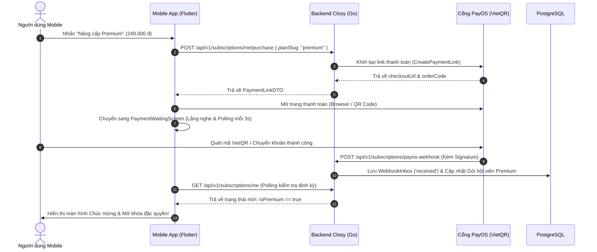

# BÁO CÁO KỸ THUẬT: LỖI CHECK CONSTRAINT WEBHOOK PAYOS & LUỒNG THANH TOÁN

> **Dành cho**: Đội ngũ Backend (`smart-wardrobe-be`)  
> **Người gửi**: Đội ngũ Frontend / Mobile  
> **Mức độ nghiêm trọng**: **CRITICAL (Chặn hoàn toàn luồng kích hoạt thanh toán)**  
> **Thời gian phát hiện**: Tháng 09/2026

---

## 1. Tóm tắt vấn đề (Executive Summary)

Khi người dùng thực hiện thanh toán gói hội viên (Premium) qua cổng **PayOS**:
1. Frontend Mobile/Web gọi `POST /api/v1/subscriptions/me/purchase` tạo đơn thành công và nhận về `paymentUrl` của PayOS.
2. Người dùng chuyển khoản quét mã VietQR thành công trên cổng PayOS.
3. PayOS gửi Webhook thông báo giao dịch thành công đến Backend (`POST /api/v1/subscriptions/payos-webhook`).
4. **LỖI CHÍ MẠNG**: Backend nhận Webhook nhưng **ném lỗi HTTP 500 / Database Check Constraint Violation**, dẫn đến giao dịch không thể lưu vào cơ sở dữ liệu và gói Premium **KHÔNG ĐƯỢC KÍCH HOẠT** cho người dùng.

---

## 2. Chi tiết Nguyên nhân Gốc (Root Cause)

### A. Lỗi gán sai hằng số viết hoa (`"RECEIVED"`)
- **Vị trí**: File [`smart-wardrobe-be/internal/modules/subscription/application/usecase/webhook/process.go`](file:///d:/Project/smart-wardrobe/smart-wardrobe-be/internal/modules/subscription/application/usecase/webhook/process.go#L156) (Dòng 156)
- **Hiện trạng code**:
```go
inbox := &entities.ProviderWebhookInbox{
    Provider:             "PAYOS",
    ProviderReference:    &ref,
    EventCode:            payload.Data.Code,
    OrderCode:            payload.Data.OrderCode,
    PaymentLinkID:        &link,
    Amount:               amount,
    Currency:             currency.Currency(payload.Data.Currency),
    CanonicalPayloadHash: hash,
    RawPayload:           entities.JSONDocument(canonical),
    ProcessingStatus:     "RECEIVED", // <--- LỖI TẠI ĐÂY: Viết hoa
    ReceivedAt:           time.Now().UTC(),
}
if err := uc.inboxRepo.Create(ctx, inbox); err != nil {
    return nil, err
}
```

### B. Cơ sở dữ liệu PostgreSQL Check Constraint
- Trong schema bảng `subscription.provider_webhook_inbox`, PostgreSQL định nghĩa:
```sql
CONSTRAINT provider_webhook_inbox_processing_status_check 
CHECK (processing_status::text = ANY (ARRAY[
    'received'::character varying, 
    'processing'::character varying, 
    'retry_required'::character varying, 
    'processed'::character varying, 
    'investigation_required'::character varying, 
    'failed'::character varying
]::text[]))
```
- Vì PostgreSQL phân biệt chữ hoa chữ thường (`'RECEIVED' != 'received'`), câu lệnh `INSERT` vào bảng `subscription.provider_webhook_inbox` lập tức bị abort với lỗi:
  ```text
  ERROR: new row for relation "provider_webhook_inbox" violates check constraint "provider_webhook_inbox_processing_status_check" (SQLSTATE 23514)
  ```

---

## 3. Hướng dẫn sửa chữa (Khuyến nghị cho Đội BE)

Trong codebase BE, package `internal/modules/subscription/domain/constants/webhookprocessingstatus` **ĐÃ CÓ SẴN** định nghĩa hằng số chuẩn:
```go
// internal/modules/subscription/domain/constants/webhookprocessingstatus/webhook_processing_status.go
const (
    Received              WebhookProcessingStatus = "received"
    Processing            WebhookProcessingStatus = "processing"
    RetryRequired         WebhookProcessingStatus = "retry_required"
    Processed             WebhookProcessingStatus = "processed"
    InvestigationRequired WebhookProcessingStatus = "investigation_required"
    Failed                WebhookProcessingStatus = "failed"
)
```

👉 **Cách khắc phục**: Sửa dòng 156 trong `process.go`:
```diff
-   ProcessingStatus:     "RECEIVED",
+   ProcessingStatus:     string(webhookprocessingstatus.Received),
```

---

## 4. Hướng dẫn Test Webhook trên Môi trường Localhost qua Ngrok

Trong file `docker-compose.yml` và `.env` của backend, dự án đã có sẵn cấu hình container Ngrok:
- **Ngrok Domain**: `https://expiring-spearmint-barbell.ngrok-free.dev`
- **Target**: `backend:8080`

### Các bước cấu hình PayOS Dashboard:
1. Đăng nhập vào [PayOS Merchant Dashboard](https://my.payos.vn/).
2. Vào mục **Cài đặt Webhook (Webhook URL)**.
3. Nhập đường dẫn Webhook chính thức:
   ```text
   https://expiring-spearmint-barbell.ngrok-free.dev/api/v1/subscriptions/payos-webhook
   ```
4. Nhấn **Xác nhận Webhook**. Backend sẽ tự động nhận và xác thực `webhook_url` thành công.
5. Khi người dùng thực hiện giao dịch thử nghiệm, PayOS sẽ gọi về qua domain Ngrok này đến máy local.

---

## 5. Kiến trúc Luồng Thanh Toán Đồng Bộ Mobile & Web

Frontend Mobile hiện đã chuẩn hóa giao diện theo đúng luồng tiêu chuẩn:


---

## 6. Đề xuất Tính năng Bổ sung (Optional)

Hiện tại, nếu người dùng muốn nhấn nút **"Tôi đã chuyển khoản xong"** để xác nhận ngay lập tức mà không cần chờ Webhook:
- Backend đã có sẵn toàn bộ logic kiểm tra trực tiếp trạng thái với PayOS trong `PaymentReconciliationUseCase`:
  ```go
  info, err := uc.gateway.GetPaymentLinkInfo(ctx, orderCode)
  if info.Status == payment.ProviderPaid {
      uc.completion.CompleteVerifiedPayment(ctx, info)
  }
  ```
- **Đề xuất**: Đội BE có thể mở một endpoint authenticated:
  `POST /api/v1/subscriptions/me/verify-payment` nhận `{ "orderCode": 123456 }`.
  Handler chỉ cần gọi 2 hàm trên để xác thực tức thì và trả về kết quả cho client.
