# Closy B2B Prototype Handoff

<!-- @import "[TOC]" {cmd="toc" depthFrom=1 depthTo=6 orderedList=false} -->

<!-- code_chunk_output -->

- [Closy B2B Prototype Handoff](#closy-b2b-prototype-handoff)
  - [Mục đích tài liệu](#mục-đích-tài-liệu)
- [Tổng quan sản phẩm](#tổng-quan-sản-phẩm)
  - [Closy hiện tại](#closy-hiện-tại)
  - [Hướng mở rộng mới](#hướng-mở-rộng-mới)
  - [Định vị đề xuất](#định-vị-đề-xuất)
- [Mô hình sản phẩm](#mô-hình-sản-phẩm)
  - [Giá trị của B2C đối với B2B](#giá-trị-của-b2c-đối-với-b2b)
  - [Giá trị của B2B đối với B2C](#giá-trị-của-b2b-đối-với-b2c)
- [Các actor chính](#các-actor-chính)
  - [Shopper](#shopper)
  - [Brand Owner](#brand-owner)
  - [Brand Staff](#brand-staff)
  - [Closy Admin](#closy-admin)
- [Kiến trúc điều hướng](#kiến-trúc-điều-hướng)
  - [Giao diện người dùng B2C](#giao-diện-người-dùng-b2c)
  - [Khu vực Local Brands](#khu-vực-local-brands)
  - [Giao diện brand](#giao-diện-brand)
- [Các tính năng B2B mới](#các-tính-năng-b2b-mới)
  - [Brand Registration](#brand-registration)
  - [Brand Storefront](#brand-storefront)
  - [Product Management](#product-management)
  - [Collection Management](#collection-management)
  - [Brand Posts](#brand-posts)
  - [Audience and Customer Management](#audience-and-customer-management)
  - [Customer Segments](#customer-segments)
  - [Campaign and Broadcast](#campaign-and-broadcast)
  - [After-sales and Customer Care](#after-sales-and-customer-care)
    - [Mục tiêu](#mục-tiêu)
    - [Các loại yêu cầu hậu mãi](#các-loại-yêu-cầu-hậu-mãi)
    - [After-sales Center dành cho shopper](#after-sales-center-dành-cho-shopper)
    - [Trạng thái yêu cầu hậu mãi](#trạng-thái-yêu-cầu-hậu-mãi)
    - [Luồng đổi size hoặc đổi màu](#luồng-đổi-size-hoặc-đổi-màu)
    - [Luồng báo lỗi sản phẩm](#luồng-báo-lỗi-sản-phẩm)
    - [Product Care Guide](#product-care-guide)
    - [Post-purchase Styling Support](#post-purchase-styling-support)
    - [Feedback after Purchase](#feedback-after-purchase)
    - [Loyalty and Retention after Purchase](#loyalty-and-retention-after-purchase)
    - [Brand After-sales Workspace](#brand-after-sales-workspace)
    - [Customer Care Request List](#customer-care-request-list)
    - [Customer Care Request Detail](#customer-care-request-detail)
    - [Care Guide Management](#care-guide-management)
    - [After-sales Analytics](#after-sales-analytics)
    - [Privacy and access](#privacy-and-access)
  - [Brand Membership](#brand-membership)
    - [Closy Premium](#closy-premium)
    - [Brand Membership](#brand-membership-1)
  - [Brand Dashboard](#brand-dashboard)
  - [Brand Analytics](#brand-analytics)
- [Các điểm kết nối với Closy B2C hiện tại](#các-điểm-kết-nối-với-closy-b2c-hiện-tại)
  - [Style with My Wardrobe](#style-with-my-wardrobe)
  - [Shop the Missing Item](#shop-the-missing-item)
  - [AI Chatbot kết nối với local brand](#ai-chatbot-kết-nối-với-local-brand)
  - [Add Purchased Product to Wardrobe](#add-purchased-product-to-wardrobe)
  - [Personalized Local Brand Feed](#personalized-local-brand-feed)
  - [Product Metadata Integration](#product-metadata-integration)
- [Màn hình dành cho shopper](#màn-hình-dành-cho-shopper)
  - [Home or Personalized Feed](#home-or-personalized-feed)
  - [Local Brand Discovery](#local-brand-discovery)
  - [Brand Profile](#brand-profile)
  - [Brand Post Detail](#brand-post-detail)
  - [Product Detail](#product-detail)
  - [Style with My Wardrobe](#style-with-my-wardrobe-1)
  - [AI Chat](#ai-chat)
  - [Membership Detail](#membership-detail)
  - [Notifications](#notifications)
  - [My Purchases](#my-purchases)
  - [After-sales Request Detail](#after-sales-request-detail)
  - [Saved Products](#saved-products)
- [Màn hình dành cho brand](#màn-hình-dành-cho-brand)
  - [Brand Dashboard](#brand-dashboard-1)
  - [Storefront Setup](#storefront-setup)
  - [Product List](#product-list)
  - [Product Form](#product-form)
  - [Collection List](#collection-list)
  - [Collection Form](#collection-form)
  - [Post List](#post-list)
  - [Create Post](#create-post)
  - [Audience](#audience)
  - [Segment Builder](#segment-builder)
  - [Campaign List](#campaign-list)
  - [Create Campaign](#create-campaign)
  - [Membership Setup](#membership-setup)
  - [Customer Care](#customer-care)
  - [Customer Care Request Detail](#customer-care-request-detail-1)
  - [Care Guide Management](#care-guide-management-1)
  - [Analytics](#analytics)
  - [Brand Settings](#brand-settings)
- [Màn hình dành cho Closy Admin](#màn-hình-dành-cho-closy-admin)
  - [Brand Approval List](#brand-approval-list)
  - [Brand Approval Detail](#brand-approval-detail)
- [Luồng demo đề xuất](#luồng-demo-đề-xuất)
  - [Luồng Brand Onboarding](#luồng-brand-onboarding)
  - [Luồng Shopper Discovery](#luồng-shopper-discovery)
  - [Luồng Style with My Wardrobe](#luồng-style-with-my-wardrobe)
  - [Luồng Brand Campaign](#luồng-brand-campaign)
  - [Luồng Membership](#luồng-membership)
  - [Luồng Add to Wardrobe](#luồng-add-to-wardrobe)
- [Phạm vi P0](#phạm-vi-p0)
  - [Shopper P0](#shopper-p0)
  - [Brand P0](#brand-p0)
  - [Admin P0](#admin-p0)
- [Phạm vi P1](#phạm-vi-p1)
- [Ngoài phạm vi prototype](#ngoài-phạm-vi-prototype)
- [Mock Data Requirements](#mock-data-requirements)
  - [User](#user)
  - [Brand](#brand)
  - [Product](#product)
  - [Wardrobe Item](#wardrobe-item)
  - [Outfit Recommendation](#outfit-recommendation)
  - [Brand Post](#brand-post)
  - [Membership Plan](#membership-plan)
  - [Audience Segment](#audience-segment)
  - [Campaign](#campaign)
  - [After-sales Request](#after-sales-request)
  - [Care Guide](#care-guide)
  - [Post-purchase Feedback](#post-purchase-feedback)
- [Trạng thái UI cần mock](#trạng-thái-ui-cần-mock)
  - [Local Brand Discovery](#local-brand-discovery-1)
  - [Product Detail](#product-detail-1)
  - [Style with My Wardrobe](#style-with-my-wardrobe-2)
  - [Campaign](#campaign-1)
  - [Membership](#membership)
  - [Brand Application](#brand-application)
- [Quy tắc UI/UX](#quy-tắc-uiux)
  - [Giữ nguyên DNA của Closy](#giữ-nguyên-dna-của-closy)
  - [Phân biệt workspace](#phân-biệt-workspace)
  - [Hiển thị nguồn recommendation](#hiển-thị-nguồn-recommendation)
  - [Quyền riêng tư](#quyền-riêng-tư)
  - [Mock data label](#mock-data-label)
- [Route đề xuất cho frontend prototype](#route-đề-xuất-cho-frontend-prototype)
  - [Shopper Routes](#shopper-routes)
  - [Brand Routes](#brand-routes)
  - [Admin Routes](#admin-routes)
- [Component đề xuất](#component-đề-xuất)
  - [Shared Components](#shared-components)
  - [Shopper Components](#shopper-components)
  - [Brand Components](#brand-components)
- [Tiêu chí hoàn thành prototype](#tiêu-chí-hoàn-thành-prototype)
  - [Luồng Shopper](#luồng-shopper)
  - [Luồng Brand](#luồng-brand)
  - [Luồng Admin](#luồng-admin)
- [Ưu tiên triển khai](#ưu-tiên-triển-khai)
  - [Ưu tiên cao nhất](#ưu-tiên-cao-nhất)
  - [Ưu tiên tiếp theo](#ưu-tiên-tiếp-theo)
  - [Chỉ làm khi còn thời gian](#chỉ-làm-khi-còn-thời-gian)
- [Thông điệp chính khi demo](#thông-điệp-chính-khi-demo)

<!-- /code_chunk_output -->

## Mục đích tài liệu

Tài liệu này mô tả phạm vi prototype B2B/B2B2C mới của Closy và cách phần này kết nối trực tiếp với hệ thống B2C hiện tại.

Đối tượng sử dụng tài liệu:

- Frontend developers
- UI/UX designers
- Product team
- Team thuyết trình và chuẩn bị SRS

Prototype có thể được triển khai bằng:

- Figma prototype
- Frontend code sử dụng mock data
- Hoặc kết hợp cả hai

Prototype không yêu cầu backend, thanh toán, giao hàng hoặc AI hoạt động thật.

---

# Tổng quan sản phẩm

## Closy hiện tại

Closy hiện là một nền tảng B2C theo mô hình freemium, cung cấp các chức năng chính:

- Quản lý tủ đồ số
- Upload quần áo vào tủ đồ
- AI nhận diện và sinh metadata cho quần áo
- AI gợi ý phối đồ
- AI fashion chatbot
- Lưu outfit
- Gói Free và Premium

Các chức năng này giúp Closy hiểu:

- Người dùng đang sở hữu những loại quần áo nào
- Phong cách thường lựa chọn
- Màu sắc yêu thích
- Nhu cầu theo hoàn cảnh
- Những category còn thiếu trong tủ đồ
- Các câu hỏi và nhu cầu thời trang phổ biến

## Hướng mở rộng mới

Closy mở rộng thành một hệ sinh thái B2B2C dành cho local fashion brands.

Local brand có thể sử dụng Closy để:

- Tạo không gian thương hiệu riêng
- Đăng sản phẩm và collection
- Tiếp cận người dùng Closy
- Xây dựng cộng đồng người theo dõi
- Đăng nội dung và lookbook
- Tạo chương trình thành viên
- Chăm sóc và phân nhóm khách hàng
- Gửi campaign và ưu đãi
- Xem dữ liệu hành vi tổng hợp
- Kết nối sản phẩm của brand với AI và tủ đồ người dùng

## Định vị đề xuất

> Closy là nền tảng thời trang kết nối tủ đồ cá nhân của người dùng với cộng đồng và sản phẩm của các local brand.

Bản tiếng Anh:

> Closy is an AI-powered fashion ecosystem where users manage and style their wardrobes, while local fashion brands build communities, understand customer preferences, and deliver more relevant products and experiences.

---

# Mô hình sản phẩm

Closy không được trình bày như hai hệ thống rời rạc.

Không nên mô tả theo hướng:

- Một website quản lý tủ đồ cho người dùng
- Cộng thêm một dashboard bán hàng cho brand

Thay vào đó, B2C và B2B phải tạo thành một vòng lặp giá trị thống nhất.

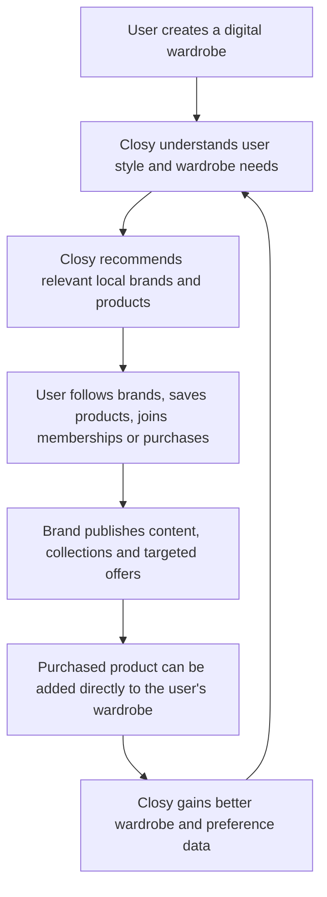

## Giá trị của B2C đối với B2B

B2C tạo ra:

- Tệp người dùng quan tâm đến thời trang
- Dữ liệu phong cách
- Dữ liệu tủ đồ
- Dữ liệu hành vi phối đồ
- Dữ liệu tương tác với chatbot
- Nhu cầu mua bổ sung theo category

## Giá trị của B2B đối với B2C

B2B cung cấp:

- Local brand để khám phá
- Sản phẩm thực tế để phối cùng tủ đồ
- Collection và lookbook
- Nội dung thời trang
- Membership và quyền lợi
- Ưu đãi phù hợp
- Khả năng mua món đồ còn thiếu

---

# Các actor chính

## Shopper

Shopper là người dùng Closy hiện tại.

Shopper có thể:

- Quản lý wardrobe
- Sử dụng AI outfit recommendation
- Sử dụng AI chatbot
- Khám phá local brand
- Follow brand
- Xem bài đăng và collection
- Lưu sản phẩm
- Tham gia membership
- Phối sản phẩm của brand với wardrobe
- Nhận ưu đãi và nội dung từ brand

## Brand Owner

Brand Owner là chủ local brand hoặc quản lý gian hàng.

Brand Owner có thể:

- Đăng ký brand
- Tạo storefront
- Quản lý profile
- Đăng sản phẩm
- Tạo collection
- Tạo bài đăng
- Gắn sản phẩm vào bài đăng
- Quản lý followers và members
- Phân nhóm audience
- Tạo campaign
- Xem analytics
- Thiết lập membership

## Brand Staff

Brand Staff là nhân sự được Brand Owner phân quyền.

Trong prototype, actor này có thể chưa cần tách quyền chi tiết.

Có thể dùng chung giao diện Brand Workspace với Brand Owner.

## Closy Admin

Closy Admin có thể:

- Xem yêu cầu đăng ký brand
- Approve hoặc reject brand
- Xem brand profile
- Kiểm duyệt nội dung cơ bản
- Xử lý report
- Khóa hoặc mở lại brand

Prototype chỉ cần thể hiện luồng approval đơn giản.

---

# Kiến trúc điều hướng

## Giao diện người dùng B2C

Navigation hiện tại có thể mở rộng thành:

```text
Home
Wardrobe
AI Outfit
AI Chat
Local Brands
Community
Profile
```

## Khu vực Local Brands

Local Brands có thể gồm các tab:

```text
Discover
Following
Collections
Memberships
Saved Products
```

## Giao diện brand

Một tài khoản có thể vừa là shopper vừa là brand owner.

Trong profile hoặc account menu cần có:

```text
Switch to Brand Workspace
```

Brand Workspace gồm:

```text
Dashboard
Storefront
Products
Collections
Posts
Audience
Campaigns
Membership
Customer Care
Analytics
Settings
```

---

# Các tính năng B2B mới

## Brand Registration

Local brand có thể gửi yêu cầu tham gia Closy.

Thông tin đề xuất:

- Brand name
- Logo
- Cover image
- Brand description
- Contact email
- Phone number
- Website hoặc social link
- Main fashion styles
- Target customer
- Business verification document
- Agreement checkbox

Trạng thái:

- Draft
- Pending Review
- Approved
- Rejected
- Suspended

Prototype chỉ cần mock luồng:

```text
Submit application
Pending review
Approved
Open Brand Workspace
```

---

## Brand Storefront

Mỗi brand có một trang riêng trong Closy.

Thông tin hiển thị:

- Logo
- Cover image
- Brand name
- Verification badge
- Brand story
- Main styles
- Follower count
- Member count
- Follow button
- Join Membership button
- Collections
- Products
- Posts
- Reviews hoặc community feedback

Các tab đề xuất:

```text
Overview
Shop
Collections
Posts
Membership
About
```

Storefront phải tạo cảm giác giống một mini website của brand nhưng vẫn thuộc hệ sinh thái Closy.

---

## Product Management

Brand có thể quản lý sản phẩm.

Thông tin sản phẩm:

- Product name
- SKU
- Images
- Description
- Price
- Discount price
- Category
- Subcategory
- Main color
- Pattern
- Material
- Style tags
- Occasion tags
- Weather suitability
- Sizes
- Stock status
- Collection
- Product status

Trạng thái sản phẩm:

- Draft
- Published
- Out of Stock
- Hidden
- Archived

Các thao tác:

- Add product
- Edit product
- Duplicate product
- Publish
- Hide
- Archive
- Add to collection
- Attach to post

Prototype chỉ cần mock dữ liệu.

---

## Collection Management

Brand có thể tạo collection như:

- Summer Collection
- Minimal Workwear
- Weekend Essentials
- Limited Drop
- Lunar New Year Collection

Thông tin collection:

- Name
- Cover image
- Description
- Start date
- End date
- Product list
- Visibility
- Member early access
- Status

Trạng thái:

- Draft
- Scheduled
- Active
- Ended

---

## Brand Posts

Brand có thể tạo nội dung để xây cộng đồng.

Loại nội dung:

- New collection
- Lookbook
- Styling tips
- Behind the scenes
- Product story
- Poll
- Restock announcement
- Member-only content
- Event announcement
- Promotion

Thông tin bài đăng:

- Caption
- Images hoặc video placeholder
- Tagged products
- Visibility
- Publish time
- Comment setting
- Like count
- Comment count
- Save count
- Product click count

Visibility:

- Public
- Followers only
- Members only

Shopper có thể:

- Like
- Comment
- Save
- Share
- View tagged product
- Follow brand

---

## Audience and Customer Management

Brand cần một khu vực để xem và chăm sóc audience.

Các nhóm hiển thị:

- Followers
- Members
- Customers
- Repeat customers
- New followers
- Inactive followers
- High-engagement users
- Users who saved products
- Users who viewed a collection
- Users interested in a style

Thông tin hồ sơ nên giới hạn:

- Display name
- Avatar
- Relationship with brand
- Follow date
- Membership status
- Number of purchases
- Total spending
- Last interaction
- Interested styles
- Commonly selected sizes
- Saved products from this brand

Brand không được xem toàn bộ wardrobe cá nhân của người dùng.

Brand không được xem nội dung AI chatbot riêng tư của người dùng.

Brand chỉ xem dữ liệu:

- Được người dùng cho phép
- Có liên quan trực tiếp đến brand
- Hoặc đã được tổng hợp và ẩn danh

---

## Customer Segments

Các segment mẫu:

- New followers
- Followers who have never purchased
- Recent customers
- Loyal customers
- Inactive customers
- Members
- Users interested in Minimal style
- Users interested in Streetwear
- Users who saved the latest collection
- Users who viewed a product but did not purchase

Brand có thể:

- Chọn segment có sẵn
- Tạo custom segment
- Xem số lượng thành viên trong segment
- Sử dụng segment khi gửi campaign

Prototype không cần xây bộ lọc phức tạp.

Chỉ cần mock một vài điều kiện:

```text
Relationship = Follower
Style Interest = Minimal
Saved Product = Yes
Last Interaction > 30 days
```

---

## Campaign and Broadcast

Brand có thể tạo campaign để chăm sóc khách hàng.

Loại campaign:

- New collection announcement
- Restock notification
- Voucher
- Member-only drop
- Early access
- Event invitation
- Birthday offer
- Win-back offer
- Product recommendation

Thông tin campaign:

- Campaign name
- Target segment
- Message title
- Message content
- Cover image
- CTA label
- CTA destination
- Schedule
- Status

Kênh trong prototype:

- Closy in-app notification
- Closy inbox

Không cần tích hợp email, SMS hoặc Zalo thật.

Trạng thái:

- Draft
- Scheduled
- Sent
- Cancelled

Mock analytics:

- Sent
- Opened
- Clicked
- Saved Product
- Added to Cart
- Joined Membership

---

## After-sales and Customer Care

Dịch vụ hậu mãi là một phần bắt buộc của prototype vì mục tiêu của Closy không chỉ là giúp local brand tiếp cận khách hàng mà còn giúp họ duy trì quan hệ sau mua.

Phần hậu mãi trong prototype nên được thiết kế theo hướng nhẹ, dễ demo và không biến Closy thành một hệ thống logistics hoặc marketplace hoàn chỉnh.

### Mục tiêu

- Giúp shopper dễ dàng yêu cầu hỗ trợ sau mua
- Giúp brand theo dõi và xử lý yêu cầu khách hàng
- Tạo lịch sử chăm sóc khách hàng tập trung
- Tăng khả năng quay lại mua hàng
- Kết nối trải nghiệm hậu mãi với wardrobe và AI styling
- Giúp brand thu thập feedback sau mua

### Các loại yêu cầu hậu mãi

- Đổi size
- Đổi màu
- Yêu cầu trả hàng
- Báo lỗi sản phẩm
- Hỏi hướng dẫn bảo quản
- Hỏi chính sách bảo hành
- Yêu cầu sửa chữa hoặc điều chỉnh kích thước
- Hỗ trợ sử dụng sản phẩm
- Khiếu nại đơn hàng
- Yêu cầu tư vấn phối đồ sau mua

### After-sales Center dành cho shopper

Shopper có một khu vực:

```text
My Purchases
After-sales Requests
Care Guides
Support Messages
```

Mỗi sản phẩm đã mua có các hành động:

- View Order
- Add to Wardrobe
- Request Exchange
- Request Return
- Report Product Issue
- View Care Guide
- Ask Brand
- Get Styling Help
- Leave Feedback

Thông tin yêu cầu hậu mãi:

- Order
- Product
- Request type
- Reason
- Description
- Image evidence placeholder
- Preferred resolution
- Created date
- Current status
- Brand response
- Timeline

### Trạng thái yêu cầu hậu mãi

```text
Draft
Submitted
Under Review
Need More Information
Approved
Rejected
In Progress
Resolved
Cancelled
```

Prototype không cần xử lý giao hàng ngược, hoàn tiền hoặc thanh toán thật.

Chỉ cần mock timeline xử lý.

### Luồng đổi size hoặc đổi màu

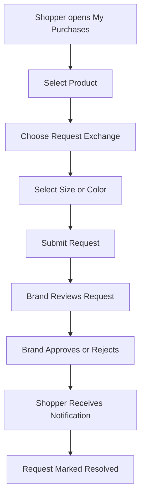

### Luồng báo lỗi sản phẩm

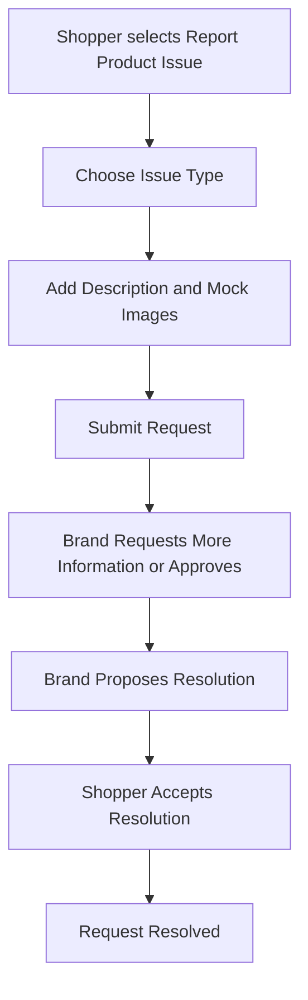

### Product Care Guide

Mỗi sản phẩm có thể có hướng dẫn chăm sóc:

- Washing instructions
- Drying instructions
- Ironing instructions
- Storage instructions
- Material notes
- Color care
- Warranty information
- Repair availability

Brand có thể thêm Care Guide khi tạo sản phẩm.

Shopper xem Care Guide tại:

- Product Detail
- My Purchases
- Wardrobe Item Detail
- After-sales Center

Điểm kết nối với wardrobe:

- Sau khi sản phẩm được thêm vào wardrobe, Care Guide vẫn đi theo item
- Người dùng có thể mở hướng dẫn bảo quản trực tiếp từ wardrobe
- AI chatbot có thể trả lời câu hỏi chăm sóc dựa trên metadata của sản phẩm

Ví dụ:

```text
How should I wash this blazer?
```

```text
Can this product be ironed at high temperature?
```

### Post-purchase Styling Support

Sau khi mua sản phẩm, shopper có thể chọn:

```text
Style My New Item
```

Closy sử dụng sản phẩm vừa mua và wardrobe hiện tại để:

- Tạo outfit đầu tiên
- Gợi ý occasion phù hợp
- Gợi ý cách phối theo thời tiết
- Giúp người dùng sử dụng sản phẩm nhiều hơn
- Giảm khả năng khách hàng cảm thấy mua nhầm

Luồng:

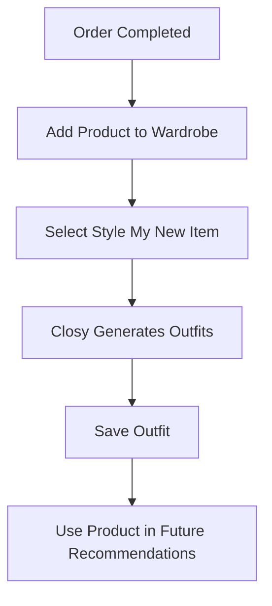

### Feedback after Purchase

Sau một khoảng thời gian mock, Closy có thể hỏi:

- Product satisfaction
- Fit accuracy
- Material satisfaction
- Color accuracy
- Delivery satisfaction
- Would recommend
- Optional comment

Feedback có thể dùng cho:

- Product review
- Brand quality insight
- Size recommendation improvement
- Customer care follow-up
- Identification of recurring product issues

Prototype chỉ cần hiển thị form đánh giá và trạng thái submitted.

### Loyalty and Retention after Purchase

Các hoạt động hậu mãi có thể kết nối với retention:

- Thank-you notification
- Care reminder
- Styling suggestion
- Review request
- Membership invitation
- Early access for repeat customers
- Voucher for next purchase
- Win-back message
- Restock suggestion for matching items

Không nên gửi tự động mọi nội dung.

Trong prototype, brand có thể chọn một audience segment như:

```text
Purchased within the last 30 days
```

hoặc:

```text
Completed after-sales request
```

để tạo campaign chăm sóc tiếp theo.

### Brand After-sales Workspace

Brand Workspace cần thêm một mục:

```text
Customer Care
```

Navigation cập nhật:

```text
Dashboard
Storefront
Products
Collections
Posts
Audience
Campaigns
Membership
Customer Care
Analytics
Settings
```

Customer Care gồm:

- Request list
- Request filters
- Request detail
- Customer conversation
- Status update
- Resolution note
- Internal note placeholder
- Care guide management
- Feedback summary

### Customer Care Request List

Các cột đề xuất:

- Request ID
- Customer
- Product
- Request type
- Submitted date
- Current status
- Priority
- Assigned staff placeholder

Filters:

- Request type
- Status
- Product
- Created date
- Priority

### Customer Care Request Detail

Thông tin hiển thị:

- Customer summary
- Order summary
- Product summary
- Request reason
- Customer description
- Image evidence placeholder
- Timeline
- Brand response
- Proposed resolution
- Status
- Internal note placeholder

Brand actions:

- Request More Information
- Approve
- Reject
- Mark In Progress
- Propose Resolution
- Mark Resolved
- Send Message

### Care Guide Management

Brand có thể:

- Tạo care guide template
- Gắn care guide vào sản phẩm
- Chỉnh hướng dẫn bảo quản
- Chỉnh thông tin bảo hành
- Chỉnh repair availability
- Preview shopper view

### After-sales Analytics

Mock analytics đề xuất:

- Total requests
- Open requests
- Resolved requests
- Average resolution time
- Top request types
- Products with most issues
- Exchange rate
- Return request rate
- Customer satisfaction after resolution
- Repeat purchase after support
- Most viewed care guides

Tất cả số liệu phải có nhãn:

```text
Demo Data
```

### Privacy and access

Brand chỉ được xem thông tin liên quan đến giao dịch và yêu cầu hậu mãi của chính brand đó.

Brand không được xem:

- Wardrobe đầy đủ của shopper
- Chatbot history không liên quan
- Sản phẩm đã mua từ brand khác
- Dữ liệu cá nhân không cần thiết cho việc xử lý yêu cầu

## Brand Membership

Mỗi brand có thể tạo chương trình membership riêng.

Cần phân biệt rõ:

### Closy Premium

Người dùng trả tiền cho Closy để nhận:

- Hạn mức wardrobe cao hơn
- Nhiều lượt AI outfit hơn
- Nhiều lượt chatbot hơn
- Các công cụ AI nâng cao

### Brand Membership

Người dùng tham gia membership của một local brand để nhận:

- Early access
- Voucher riêng
- Limited collection
- Member-only posts
- Voting hoặc poll
- Special event
- Styling session
- Membership badge

Thông tin membership plan:

- Plan name
- Monthly price
- Description
- Benefits
- Badge
- Early access duration
- Member-only discount
- Visibility
- Status

Prototype có thể có một plan duy nhất cho mỗi brand để giảm phạm vi.

---

## Brand Dashboard

Dashboard hiển thị mock data.

KPI đề xuất:

- Total followers
- New followers
- Total members
- Active members
- Profile views
- Product views
- Product saves
- Post engagement
- Campaign clicks
- Repeat customers
- Products used in AI Styling
- Wardrobe Match requests

Widget đề xuất:

- Overview cards
- Follower growth chart
- Top products
- Top posts
- Top styles among followers
- Recent activity
- Recent comments
- Active campaigns

Tất cả số liệu phải ghi rõ:

```text
Demo Data
```

Không trình bày mock data như kết quả thật của Closy.

---

## Brand Analytics

Các insight đề xuất:

- Phong cách được quan tâm nhiều nhất
- Màu sắc được lưu nhiều nhất
- Category được tìm kiếm nhiều
- Size được xem nhiều
- Product được dùng nhiều trong Style with My Wardrobe
- Product có nhiều lượt save nhưng chưa mua
- Post có engagement cao
- Collection có nhiều follower quan tâm
- Nhóm người dùng đang thiếu một category cụ thể
- Tỷ lệ follow sau khi xem storefront
- Tỷ lệ click sản phẩm từ bài đăng

Dữ liệu nên được tổng hợp.

Ví dụ:

```text
38% of engaged followers prefer Minimal style
26% frequently choose Casual outfits
Black and Beige are the most saved colors
Blazers are the most requested missing category
```

---

# Các điểm kết nối với Closy B2C hiện tại

## Style with My Wardrobe

Đây là tính năng kết nối quan trọng nhất.

Tại Product Detail, shopper có thể chọn:

```text
Style with My Wardrobe
```

Luồng:

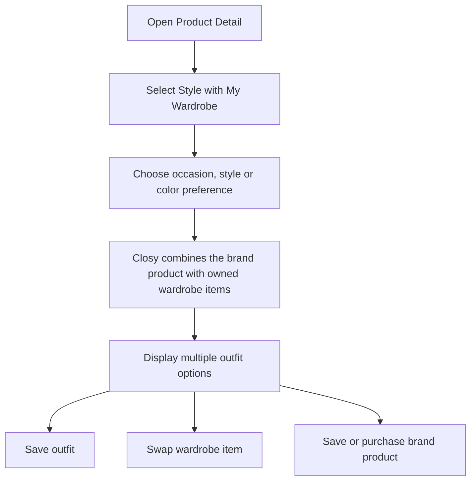

Kết quả outfit gồm:

- Sản phẩm của brand đang xem
- Các item trong wardrobe người dùng
- Occasion
- Style
- Color harmony
- Lý do gợi ý ngắn
- Save Outfit
- Swap Item
- Regenerate
- View Product
- Add to Cart hoặc mock Buy

Giá trị:

- Người dùng biết sản phẩm có phù hợp với đồ đang sở hữu hay không
- Brand tăng khả năng chuyển đổi
- Closy sử dụng được năng lực AI hiện tại
- Closy khác với marketplace thông thường

---

## Shop the Missing Item

Khi AI phối đồ từ wardrobe nhưng phát hiện thiếu category phù hợp, Closy có thể đề xuất sản phẩm từ local brand.

Ví dụ:

```text
This outfit would work better with a black blazer.
```

Closy hiển thị:

- Sản phẩm phù hợp
- Brand
- Price
- Compatibility score hoặc Match label
- Reason
- View Product
- Style with My Wardrobe
- Save Product

Nguyên tắc UI:

- Chỉ đề xuất khi có ngữ cảnh phù hợp
- Không chèn sản phẩm vào mọi recommendation
- Hiển thị rõ sản phẩm của brand
- Sponsored item phải có nhãn rõ ràng nếu có
- Ưu tiên relevance hơn quảng cáo

---

## AI Chatbot kết nối với local brand

AI chatbot hiện tại có thể hỗ trợ câu hỏi liên quan đến brand và sản phẩm.

Ví dụ:

```text
Tìm cho mình một chiếc váy đi tiệc dưới 1.500.000 VNĐ.
```

```text
Có local brand nào theo phong cách minimal không?
```

```text
Phối chiếc áo này với quần trong tủ đồ của mình.
```

```text
Tìm một sản phẩm phù hợp với chiếc quần đen mình đang có.
```

```text
Brand này có sản phẩm nào hợp đi làm không?
```

Chatbot có thể trả về:

- Brand card
- Product card
- Collection card
- Outfit card
- Suggested action
- Link đến Brand Profile
- Link đến Product Detail
- Button Style with My Wardrobe

Prototype không cần chatbot thật.

Có thể dùng conversation cố định và các response card mock.

---

## Add Purchased Product to Wardrobe

Sau khi mock purchase hoàn tất, Closy hiển thị:

```text
Add this item to your wardrobe?
```

Luồng:

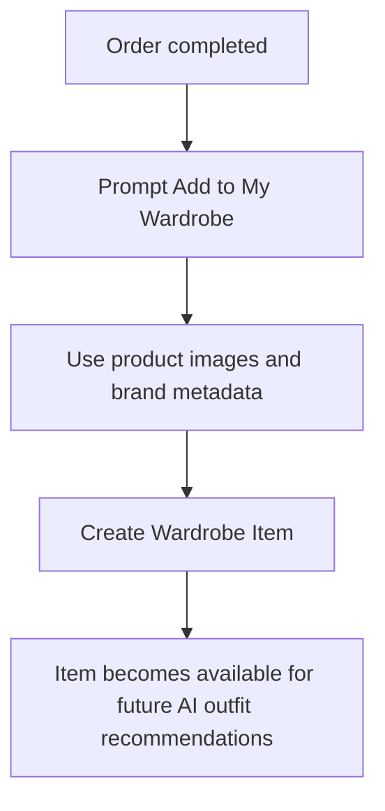

Lợi ích:

- Người dùng không cần upload lại
- Metadata đã có sẵn
- Trải nghiệm wardrobe liền mạch
- AI có thêm item mới để phối đồ

Prototype chỉ cần mô phỏng trạng thái thành công.

---

## Personalized Local Brand Feed

Feed có thể sử dụng dữ liệu từ:

- Brand đang follow
- Phong cách thường chọn
- Màu sắc yêu thích
- Occasion thường sử dụng
- Sản phẩm đã save
- Category còn thiếu trong wardrobe
- Lịch sử tương tác trong Closy

Feed hiển thị:

- Brand posts
- Collection mới
- Product phù hợp
- Lookbook
- Styling tips
- Member content
- Recommended brand
- Shop the Missing Item card

Mỗi card cần ghi rõ lý do đề xuất nếu phù hợp.

Ví dụ:

```text
Recommended because you often choose Minimal style.
```

```text
Matches items in your wardrobe.
```

```text
From a brand you follow.
```

---

## Product Metadata Integration

Sản phẩm của brand có thể sử dụng cùng hệ thống metadata với Wardrobe Item.

Metadata chung:

- Category
- Subcategory
- Color
- Pattern
- Material
- Style
- Occasion
- Season
- Weather
- Fit
- Gender target

Điều này cho phép:

- AI chatbot tìm kiếm sản phẩm
- AI outfit recommendation sử dụng sản phẩm
- Product matching với wardrobe
- Personalized discovery
- Brand analytics

Prototype chỉ cần hiển thị metadata trong Product Management.

---

# Màn hình dành cho shopper

## Home or Personalized Feed

Nội dung:

- Greeting
- Quick access to Wardrobe
- AI Outfit shortcut
- AI Chat shortcut
- Local brand recommendations
- New collections
- Posts from followed brands
- Shop the Missing Item
- Personalized products

## Local Brand Discovery

Nội dung:

- Search
- Filter by style
- Filter by category
- Featured brands
- New brands
- Trending collections
- Recommended for you
- Following section

## Brand Profile

Nội dung:

- Cover
- Logo
- Story
- Style tags
- Follow
- Membership
- Customer Care
- Care Guide
- After-sales Request
- Product list
- Collection list
- Post list
- About

## Brand Post Detail

Nội dung:

- Post content
- Media
- Tagged products
- Like
- Comment
- Save
- Share
- Follow
- Open Product

## Product Detail

Nội dung:

- Product images
- Name
- Brand
- Price
- Discount
- Color
- Size
- Stock
- Description
- Style tags
- Occasion
- Add to Cart
- Save Product
- Style with My Wardrobe
- Related products
- Brand information

## Style with My Wardrobe

Nội dung:

- Selected brand product
- Occasion selector
- Style selector
- Color preference
- Existing wardrobe items
- Generated outfit cards
- Swap Item
- Regenerate
- Save Outfit
- View Brand Product

## AI Chat

Nội dung:

- Conversation
- Suggested prompts
- Product cards
- Brand cards
- Outfit cards
- Style with My Wardrobe CTA

## Membership Detail

Nội dung:

- Membership name
- Monthly price
- Benefits
- Member badge
- Exclusive posts preview
- Join button
- Confirmation state

## Notifications

Nội dung:

- New collection
- Restock
- Voucher
- Early access
- Member post
- Campaign message
- Follow activity

## My Purchases

Nội dung:

- Order summary
- Purchased products
- Order status
- Add to Wardrobe
- Style My New Item
- Request Exchange
- Request Return
- Report Product Issue
- View Care Guide
- Leave Feedback

## After-sales Request Detail

Nội dung:

- Request type
- Product
- Reason
- Description
- Mock image evidence
- Current status
- Brand response
- Timeline
- Cancel request
- Send additional information

## Saved Products

Nội dung:

- Product cards
- Brand
- Price
- Stock
- Style with My Wardrobe
- Remove from saved
- Open Product

---

# Màn hình dành cho brand

## Brand Dashboard

Nội dung:

- KPI cards
- Follower chart
- Membership summary
- Top products
- Top posts
- Active campaign
- Recent comments
- AI styling usage
- Demo Data label

## Storefront Setup

Nội dung:

- Logo
- Cover
- Brand name
- Description
- Story
- Main styles
- Social links
- Contact
- Preview storefront
- Save draft
- Publish

## Product List

Nội dung:

- Product table hoặc grid
- Search
- Filters
- Product status
- Stock
- Price
- Collection
- Add Product
- Edit
- Hide
- Archive

## Product Form

Nội dung:

- Images
- Name
- Description
- Price
- Category
- Color
- Style
- Occasion
- Sizes
- Stock
- Collection
- Preview
- Save draft
- Publish

## Collection List

Nội dung:

- Collection cards
- Status
- Date
- Product count
- Member early access
- Create Collection

## Collection Form

Nội dung:

- Name
- Cover
- Description
- Products
- Start date
- End date
- Visibility
- Early access
- Save
- Publish

## Post List

Nội dung:

- Post preview
- Visibility
- Status
- Engagement
- Tagged products
- Create Post

## Create Post

Nội dung:

- Content
- Media placeholder
- Tag products
- Post type
- Visibility
- Schedule
- Preview
- Publish

## Audience

Nội dung:

- Audience summary
- Followers
- Members
- Customers
- Segments
- Search
- Filters
- Customer profile drawer

## Segment Builder

Nội dung:

- Segment name
- Conditions
- Estimated audience size
- Save segment
- Use in Campaign

## Campaign List

Nội dung:

- Campaign name
- Target
- Status
- Scheduled time
- Open rate
- Click rate
- Create Campaign

## Create Campaign

Nội dung:

- Campaign type
- Audience segment
- Title
- Message
- Image
- CTA
- Schedule
- Preview
- Send or Schedule

## Membership Setup

Nội dung:

- Plan name
- Price
- Benefits
- Badge
- Early access duration
- Discount
- Member-only content
- Status
- Preview

## Customer Care

Nội dung:

- Request list
- Search
- Filters
- Request type
- Status
- Priority
- Product
- Customer
- Submitted date
- Open Request Detail

## Customer Care Request Detail

Nội dung:

- Customer summary
- Order summary
- Product summary
- Request description
- Mock image evidence
- Timeline
- Brand response
- Proposed resolution
- Request More Information
- Approve
- Reject
- Mark In Progress
- Mark Resolved

## Care Guide Management

Nội dung:

- Care guide templates
- Product mapping
- Washing instructions
- Drying instructions
- Ironing instructions
- Storage instructions
- Warranty information
- Repair availability
- Preview shopper view

## Analytics

Nội dung:

- Audience style distribution
- Color preferences
- Product saves
- Product views
- AI styling usage
- Top missing categories
- Campaign performance
- Member growth
- Demo Data label

## Brand Settings

Nội dung:

- Account information
- Brand information
- Notification settings
- Staff placeholder
- Membership settings
- Privacy
- Close brand workspace

---

# Màn hình dành cho Closy Admin

## Brand Approval List

Nội dung:

- Brand name
- Submitted date
- Category
- Status
- View application
- Approve
- Reject

## Brand Approval Detail

Nội dung:

- Brand information
- Documents placeholder
- Social links
- Description
- Approve
- Reject
- Rejection reason

Prototype không cần thêm admin dashboard phức tạp.

---

# Luồng demo đề xuất

## Luồng Brand Onboarding

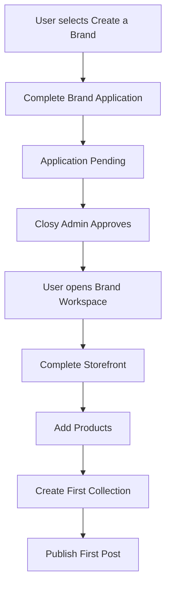

## Luồng Shopper Discovery

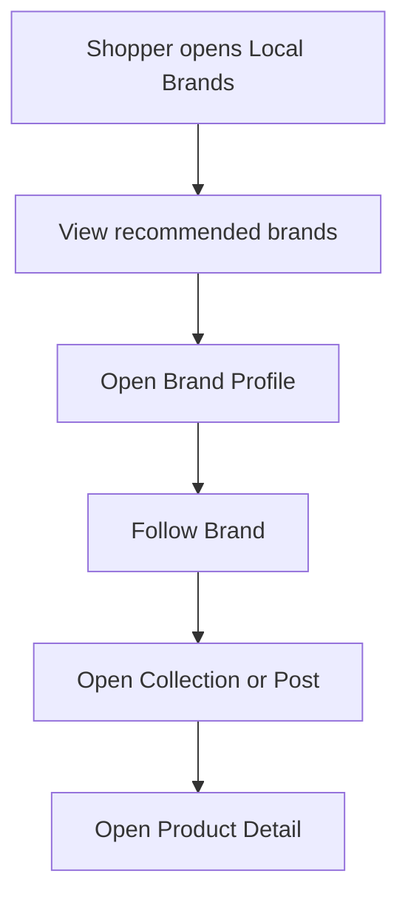

## Luồng Style with My Wardrobe

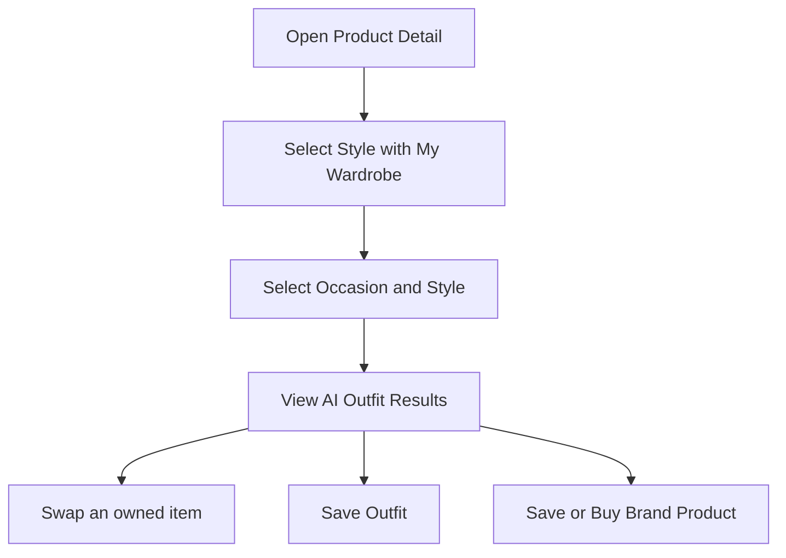

## Luồng Brand Campaign

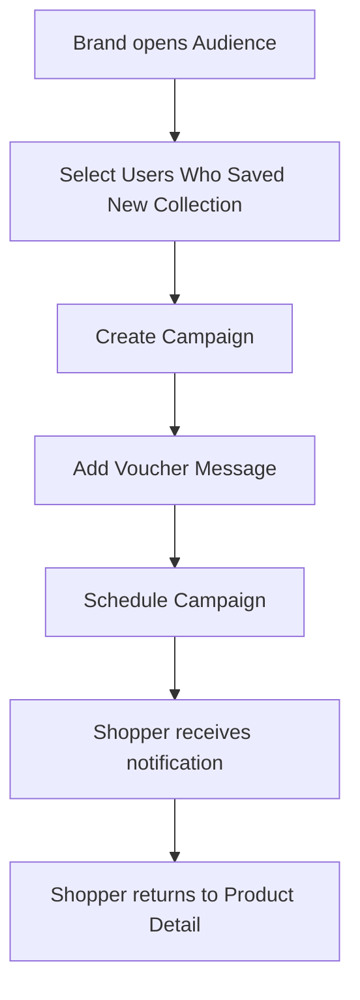

## Luồng Membership

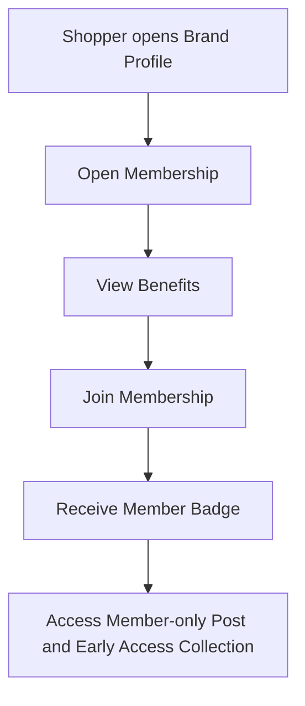

## Luồng Add to Wardrobe

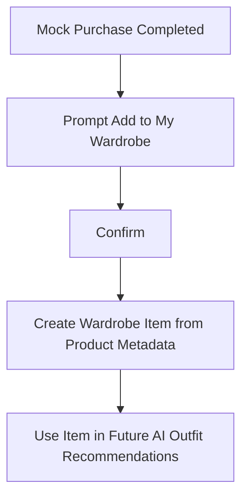

---

# Phạm vi P0

P0 là phạm vi bắt buộc nên có trong prototype.

## Shopper P0

- Local Brand Discovery
- Brand Profile
- Brand Post Detail
- Product Detail
- Follow Brand
- Join Membership
- Style with My Wardrobe
- AI Outfit Result có sản phẩm brand
- AI Chat response có product hoặc brand card
- Notification từ brand
- My Purchases
- Submit After-sales Request
- View Care Guide
- Style My New Item
- Leave Post-purchase Feedback
- Add Purchased Product to Wardrobe

## Brand P0

- Brand Dashboard
- Storefront Setup
- Product Management
- Collection Management
- Create Brand Post
- Audience Overview
- Customer Segments
- Create Campaign
- Membership Setup
- Customer Care Request List
- Customer Care Request Detail
- Care Guide Management
- After-sales Analytics bằng mock data
- Analytics bằng mock data

## Admin P0

- Brand Approval List
- Brand Approval Detail
- Approve hoặc Reject

---

# Phạm vi P1

P1 chỉ thực hiện nếu còn thời gian.

- Brand reviews
- Product reviews
- Brand staff roles
- Multiple membership tiers
- Advanced segment builder
- Scheduled posts
- Saved campaign templates
- Customer detail history
- Product comparison
- Share outfit
- QR code storefront
- Member voting
- Event registration
- Brand inbox
- Mock order history
- Wishlist reminder
- Back-in-stock subscription

---

# Ngoài phạm vi prototype

Không triển khai các phần sau trong prototype đầu tiên:

- Thanh toán thật
- Logistics
- Shipping provider
- Escrow
- Refund
- Return workflow đầy đủ
- Dispute resolution
- Marketplace commission engine
- Seller ads
- Affiliate
- Livestream
- Realtime chat
- Email integration
- SMS integration
- Zalo integration
- Virtual try-on
- AI-generated model
- POS integration
- Inventory forecasting
- Multi-warehouse management
- Tax invoice
- Accounting
- Advanced CRM
- Full role and permission system
- Real AI inference
- Real recommendation engine
- Real analytics pipeline

---

# Mock Data Requirements

Frontend cần chuẩn bị mock data cho các entity sau.

## User

```json
{
  "id": "user_001",
  "name": "Linh Nguyen",
  "avatarUrl": "/mock/users/linh.jpg",
  "closyPlan": "PREMIUM",
  "preferredStyles": ["Minimal", "Elegant"],
  "preferredColors": ["Black", "Beige"],
  "followedBrandIds": ["brand_001"],
  "membershipBrandIds": ["brand_001"]
}
```

## Brand

```json
{
  "id": "brand_001",
  "name": "Mori Studio",
  "logoUrl": "/mock/brands/mori-logo.png",
  "coverUrl": "/mock/brands/mori-cover.jpg",
  "description": "Minimal everyday wear for modern women.",
  "story": "A local fashion brand focused on versatile and timeless pieces.",
  "styles": ["Minimal", "Elegant"],
  "isVerified": true,
  "followerCount": 12450,
  "memberCount": 582,
  "isFollowing": true
}
```

## Product

```json
{
  "id": "product_001",
  "brandId": "brand_001",
  "name": "Luna Structured Blazer",
  "sku": "MORI-BLZ-001",
  "imageUrls": ["/mock/products/blazer-front.jpg", "/mock/products/blazer-back.jpg"],
  "price": 1290000,
  "discountPrice": 1090000,
  "category": "Outerwear",
  "subcategory": "Blazer",
  "colors": ["Black"],
  "styles": ["Minimal", "Elegant", "Workwear"],
  "occasions": ["Work", "Meeting", "Date"],
  "sizes": ["S", "M", "L"],
  "stockStatus": "IN_STOCK",
  "collectionId": "collection_001",
  "isSaved": false
}
```

## Wardrobe Item

```json
{
  "id": "wardrobe_item_001",
  "userId": "user_001",
  "name": "White Basic Shirt",
  "imageUrl": "/mock/wardrobe/white-shirt.jpg",
  "category": "Top",
  "color": "White",
  "styles": ["Minimal", "Workwear"]
}
```

## Outfit Recommendation

```json
{
  "id": "outfit_001",
  "title": "Minimal Office Look",
  "occasion": "Work",
  "style": "Minimal",
  "explanation": "The structured blazer works well with the clean white shirt and neutral trousers.",
  "items": [
    {
      "sourceType": "BRAND_PRODUCT",
      "sourceId": "product_001"
    },
    {
      "sourceType": "WARDROBE_ITEM",
      "sourceId": "wardrobe_item_001"
    },
    {
      "sourceType": "WARDROBE_ITEM",
      "sourceId": "wardrobe_item_002"
    }
  ]
}
```

## Brand Post

```json
{
  "id": "post_001",
  "brandId": "brand_001",
  "type": "LOOKBOOK",
  "caption": "Three ways to style our Luna Structured Blazer.",
  "mediaUrls": ["/mock/posts/mori-lookbook.jpg"],
  "taggedProductIds": ["product_001"],
  "visibility": "PUBLIC",
  "likeCount": 1260,
  "commentCount": 84,
  "saveCount": 342
}
```

## Membership Plan

```json
{
  "id": "membership_001",
  "brandId": "brand_001",
  "name": "Mori Circle",
  "monthlyPrice": 79000,
  "badge": "MORI_MEMBER",
  "benefits": [
    "48-hour early access",
    "10% member discount",
    "Member-only styling content",
    "Limited collection access"
  ],
  "isActive": true
}
```

## Audience Segment

```json
{
  "id": "segment_001",
  "brandId": "brand_001",
  "name": "Minimal Style Followers",
  "estimatedSize": 2840,
  "conditions": [
    {
      "field": "preferredStyle",
      "operator": "CONTAINS",
      "value": "Minimal"
    },
    {
      "field": "relationship",
      "operator": "EQUALS",
      "value": "FOLLOWER"
    }
  ]
}
```

## Campaign

```json
{
  "id": "campaign_001",
  "brandId": "brand_001",
  "name": "Luna Blazer Restock",
  "type": "RESTOCK",
  "segmentId": "segment_001",
  "title": "Luna Blazer is back",
  "message": "Your saved blazer is available again. Members receive early access.",
  "ctaLabel": "View Product",
  "ctaTarget": "/brands/mori-studio/products/luna-blazer",
  "status": "SCHEDULED",
  "scheduledAt": "2026-06-27T09:00:00+07:00"
}
```

## After-sales Request

```json
{
  "id": "after_sales_001",
  "orderId": "order_001",
  "brandId": "brand_001",
  "userId": "user_001",
  "productId": "product_001",
  "type": "SIZE_EXCHANGE",
  "reason": "The selected size is too small.",
  "preferredResolution": "Exchange from size S to size M",
  "status": "UNDER_REVIEW",
  "priority": "NORMAL",
  "createdAt": "2026-06-24T14:30:00+07:00",
  "timeline": [
    {
      "status": "SUBMITTED",
      "timestamp": "2026-06-24T14:30:00+07:00"
    },
    {
      "status": "UNDER_REVIEW",
      "timestamp": "2026-06-24T16:00:00+07:00"
    }
  ]
}
```

## Care Guide

```json
{
  "id": "care_guide_001",
  "productId": "product_001",
  "washing": "Dry clean recommended.",
  "drying": "Do not tumble dry.",
  "ironing": "Use low heat with a protective cloth.",
  "storage": "Store on a structured hanger.",
  "warranty": "Manufacturing defects are supported within 30 days.",
  "repairAvailable": true
}
```

## Post-purchase Feedback

```json
{
  "id": "feedback_001",
  "orderId": "order_001",
  "productId": "product_001",
  "fitScore": 4,
  "materialScore": 5,
  "colorAccuracyScore": 5,
  "overallScore": 4,
  "wouldRecommend": true,
  "comment": "Good material and easy to style with my wardrobe."
}
```

---

# Trạng thái UI cần mock

Mỗi màn hình quan trọng nên có ít nhất các trạng thái sau:

- Loading
- Empty
- Success
- Validation Error
- Permission Denied
- Draft
- Published
- Disabled
- Out of Stock

Các trạng thái quan trọng cần thể hiện:

## Local Brand Discovery

- Có recommendation
- Không có brand phù hợp
- Search không có kết quả

## Product Detail

- In stock
- Out of stock
- Product saved
- Size not selected

## Style with My Wardrobe

- Generating
- Generated
- No compatible wardrobe items
- Regenerate
- Outfit saved

## Campaign

- Draft
- Scheduled
- Sent

## Membership

- Not joined
- Joined
- Cancelled hoặc expired placeholder

## Brand Application

- Pending
- Approved
- Rejected

---

# Quy tắc UI/UX

## Giữ nguyên DNA của Closy

Phần B2B không nên có visual style giống một sản phẩm hoàn toàn khác.

Cần duy trì:

- Typography hiện tại
- Color system hiện tại
- Border radius hiện tại
- Button style hiện tại
- Card style hiện tại
- Icon style hiện tại
- Spacing system hiện tại

Brand Workspace có thể chuyên nghiệp hơn nhưng vẫn thuộc Closy.

## Phân biệt workspace

Shopper UI:

- Trực quan
- Lifestyle
- Fashion-first
- Hình ảnh lớn
- Feed và card

Brand Workspace:

- Dashboard-oriented
- Data table
- Form
- Analytics
- Management actions

## Hiển thị nguồn recommendation

Recommendation nên có lý do:

```text
Matches your Minimal style
```

```text
Works with items in your wardrobe
```

```text
From a brand you follow
```

## Quyền riêng tư

UI phải tránh tạo cảm giác brand có thể xem toàn bộ dữ liệu cá nhân.

Trong Audience hoặc Analytics có thể hiển thị thông báo:

```text
Insights are aggregated and privacy-protected.
```

## Mock data label

Dashboard và analytics phải có:

```text
Demo Data
```

---

# Route đề xuất cho frontend prototype

## Shopper Routes

```text
/
 /wardrobe
 /ai-outfit
 /ai-chat
 /local-brands
 /local-brands/following
 /local-brands/collections
 /local-brands/memberships
 /saved-products
 /brands/:brandId
 /brands/:brandId/posts/:postId
 /brands/:brandId/products/:productId
 /brands/:brandId/membership
 /products/:productId/style-with-wardrobe
 /notifications
 /purchases
 /purchases/:orderId
 /purchases/:orderId/after-sales/new
 /after-sales
 /after-sales/:requestId
```

## Brand Routes

```text
/brand
/brand/dashboard
/brand/storefront
/brand/products
/brand/products/new
/brand/products/:productId/edit
/brand/collections
/brand/collections/new
/brand/posts
/brand/posts/new
/brand/audience
/brand/audience/segments
/brand/audience/segments/new
/brand/campaigns
/brand/campaigns/new
/brand/membership
/brand/customer-care
/brand/customer-care/:requestId
/brand/care-guides
/brand/analytics
/brand/settings
```

## Admin Routes

```text
/admin/brands
/admin/brands/:brandId/review
```

---

# Component đề xuất

## Shared Components

- AppShell
- TopNavigation
- Sidebar
- UserMenu
- BrandSwitcher
- SearchBar
- FilterChip
- EmptyState
- LoadingSkeleton
- StatusBadge
- ConfirmationModal
- Toast
- ImageUploaderMock
- PaginationMock

## Shopper Components

- BrandCard
- BrandHeader
- BrandPostCard
- ProductCard
- CollectionCard
- MembershipCard
- OutfitCard
- WardrobeItemCard
- RecommendationReason
- ProductTag
- NotificationCard
- AIChatProductCard
- AIChatBrandCard
- PurchaseCard
- AfterSalesRequestCard
- AfterSalesTimeline
- CareGuideCard
- PostPurchaseFeedbackForm

## Brand Components

- MetricCard
- AnalyticsChart
- DataTable
- ProductForm
- CollectionForm
- PostComposer
- AudienceTable
- SegmentRuleBuilder
- CampaignComposer
- MembershipForm
- CustomerCareTable
- CustomerCareRequestPanel
- ResolutionComposer
- CareGuideForm
- StorefrontPreview
- DemoDataBadge

---

# Tiêu chí hoàn thành prototype

Prototype được xem là hoàn thành khi có thể demo liên tục các luồng sau.

## Luồng Shopper

- Mở Local Brands
- Chọn một brand
- Follow brand
- Xem bài đăng
- Mở sản phẩm
- Chọn Style with My Wardrobe
- Nhận outfit
- Lưu outfit
- Mock purchase
- Add Product to Wardrobe
- Style My New Item
- View Care Guide
- Submit After-sales Request
- View Request Timeline
- Leave Feedback
- Tham gia Membership
- Nhận notification

## Luồng Brand

- Switch to Brand Workspace
- Xem Dashboard
- Tạo hoặc chỉnh storefront
- Tạo sản phẩm
- Tạo collection
- Tạo bài đăng
- Xem audience
- Chọn segment
- Tạo campaign
- Thiết lập membership
- Xem Customer Care
- Xử lý một After-sales Request
- Cập nhật Care Guide
- Xem after-sales analytics
- Xem analytics

## Luồng Admin

- Mở Brand Approval List
- Xem hồ sơ brand
- Approve brand

---

# Ưu tiên triển khai

## Ưu tiên cao nhất

- Local Brand Discovery
- Brand Profile
- Product Detail
- Style with My Wardrobe
- Brand Dashboard
- Product Management
- Create Post
- Audience
- Campaign
- Membership

## Ưu tiên tiếp theo

- AI Chat product discovery
- Add Purchased Product to Wardrobe
- Collection Management
- Notifications
- Analytics
- Brand Approval

## Chỉ làm khi còn thời gian

- Reviews
- Staff
- Multiple membership tiers
- Advanced segments
- Scheduled posts
- Brand inbox
- Event registration

---

# Thông điệp chính khi demo

Prototype phải giúp người xem hiểu được:

- Closy không bỏ hệ thống B2C hiện tại
- Digital wardrobe và AI là lợi thế cạnh tranh của Closy
- Local brand có một không gian để xây dựng thương hiệu
- Brand có thể tiếp cận đúng nhóm khách hàng
- Brand có thể chăm sóc followers, customers và members
- Người dùng nhận sản phẩm phù hợp với phong cách và wardrobe
- B2C tạo dữ liệu và audience
- B2B tạo nội dung, sản phẩm và doanh thu
- Hai phía tạo thành một vòng lặp giá trị duy nhất

Câu mô tả ngắn:

> Closy connects personal wardrobes with local fashion brands, helping users discover items that fit their real style while enabling brands to build communities and nurture long-term customer relationships.
