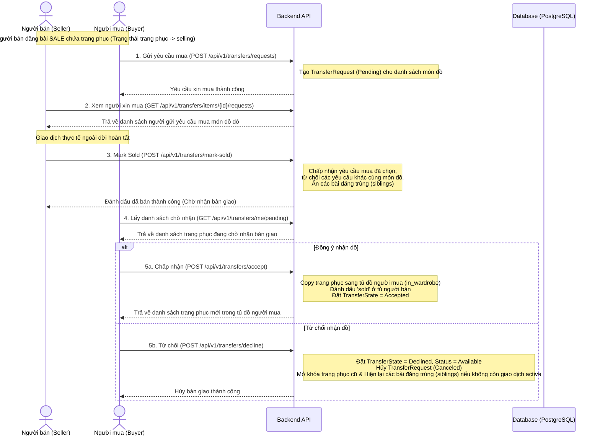

# Tài liệu Nghiệp vụ Luồng Chuyển nhượng Trang phục (Item Transfer Flow)

Tài liệu này mô tả chi tiết quy trình bàn giao/chuyển nhượng trang phục (Item Transfer) giữa hai người dùng (Người bán và Người mua) sau khi thực hiện giao dịch thực tế ngoài đời từ bài đăng thanh lý (`SALE`). 

---

## 1. Các Tác nhân & Thực thể liên quan

- **Người bán (Seller / Chủ bài đăng)**: Sở hữu một trang phục cá nhân và đăng bán dưới dạng bài đăng cộng đồng loại `SALE`.
- **Người mua (Buyer)**: Tiếp cận bài đăng, gửi yêu cầu xin mua, nhận bàn giao sản phẩm và đưa món đồ về tủ đồ cá nhân.
- **Post Item (Sản phẩm bài đăng)**: Liên kết giữa bài đăng (`posts`) và trang phục trong tủ đồ (`wardrobe_items`).
- **Wardrobe Item (Trang phục)**: Đối tượng vật lý được lưu trữ trong tủ đồ của người dùng.
- **Transfer Request (Yêu cầu xin mua)**: Thực thể trung gian được tạo ra khi người mua gửi yêu cầu muốn mua sản phẩm từ bài đăng của người bán.

---

## 2. Bảng Trạng thái & Ý nghĩa

Luồng chuyển nhượng được điều khiển bởi trạng thái của các thực thể sau:

### A. Trạng thái Trang phục trong tủ đồ (`WardrobeItem.Status`)

| Trạng thái | Mã số | Ý nghĩa |
| :--- | :--- | :--- |
| `in_wardrobe` | `0` | Trang phục đang nằm trong tủ đồ bình thường, có thể dùng phối đồ hoặc đăng bán. |
| `selling` | `1` | Trang phục đang được rao bán trên ít nhất một bài đăng loại `SALE` (tạm khóa). |
| `sold` | `2` | Trang phục đã được bán thành công cho người khác, không thể sử dụng hay sửa đổi. |

### B. Trạng thái Sản phẩm trong bài đăng (`PostItem.Status`)

| Trạng thái | Mã số | Ý nghĩa |
| :--- | :--- | :--- |
| `Available` | `0` | Sản phẩm đang được hiển thị công khai trên bài đăng, có thể gửi yêu cầu mua. |
| `Sold` | `1` | Sản phẩm đã được người bán đánh dấu bán thành công cho một người mua cụ thể (chờ nhận). |
| `Hidden` | `2` | Sản phẩm bị ẩn (tự động xảy ra khi món đồ đó được bán ở một bài đăng khác của cùng người bán). |

### C. Trạng thái Giao dịch/Bàn giao (`PostItem.TransferState`)

| Trạng thái | Mã số | Ý nghĩa |
| :--- | :--- | :--- |
| `None` | `0` | Không có giao dịch chuyển nhượng nào diễn ra. |
| `Pending` | `1` | Người bán đã đánh dấu bán cho Người mua, đang chờ Người mua xác nhận đồng ý nhận. |
| `Accepted` | `2` | Người mua đã đồng ý nhận món đồ thành công. |
| `Declined` | `3` | Người mua từ chối nhận món đồ bàn giao. |

### D. Trạng thái Yêu cầu xin mua (`TransferRequest.Status`)

| Trạng thái | Mã số | Ý nghĩa |
| :--- | :--- | :--- |
| `Pending` | `0` | Người mua đã gửi yêu cầu mua sản phẩm, đang chờ người bán phản hồi. |
| `Accepted` | `1` | Người bán đồng ý bán sản phẩm này cho người mua (kích hoạt luồng chuyển nhượng). |
| `Rejected` | `2` | Yêu cầu bị người bán từ chối (hoặc tự động bị từ chối khi món đồ được bán cho người khác). |
| `Canceled` | `3` | Yêu cầu bị hủy (tự động xảy ra khi người mua từ chối nhận bàn giao sản phẩm). |

---

## 3. Quy trình Nghiệp vụ & APIs Được Gọi

Dưới đây là sơ đồ tuần tự biểu diễn luồng hoạt động từ lúc người mua gửi yêu cầu cho tới khi hoàn tất chuyển nhượng:



---

## 4. Chi tiết xử lý kỹ thuật của từng API

### API 1: Gửi yêu cầu xin mua (Create Transfer Requests)

- **Mục đích**: Người mua gửi yêu cầu muốn mua một hoặc nhiều sản phẩm trong bài đăng của người bán.
- **Phương thức**: `POST`
- **Đường dẫn**: `/api/v1/transfers/requests`
- **Body Request**:
    ```json
    {
        "postItemIds": [
            "uuid-post-item-1",
            "uuid-post-item-2"
        ]
    }
    ```
- **Xử lý Logic**:
    1. Xác thực danh sách `postItemIds` tồn tại trong hệ thống.
    2. Kiểm tra trạng thái của các `PostItem`: Phải có `Status` = `Available` và `TransferState` = `None`.
    3. Đảm bảo Người mua không tự gửi yêu cầu mua sản phẩm thuộc bài đăng của chính mình (so sánh `Post.UserID` với `BuyerUserID`).
    4. Tìm kiếm các yêu cầu cũ của Buyer này cho sản phẩm tương ứng:
        - Nếu đã tồn tại yêu cầu cũ (nhưng đã bị từ chối hoặc hủy), cập nhật trạng thái yêu cầu về lại `Pending`.
        - Nếu chưa tồn tại, tạo mới bản ghi `TransferRequest` với `Status` = `Pending`.

---

### API 2: Lấy danh sách người xin mua (Get Transfer Requests for Seller)

- **Mục đích**: Người bán xem danh sách những người mua đã gửi yêu cầu xin mua cho một món đồ cụ thể.
- **Phương thức**: `GET`
- **Đường dẫn**: `/api/v1/transfers/items/:postItemID/requests`
- **Xử lý Logic**:
    1. Kiểm tra sản phẩm (`PostItem`) theo `postItemID` có tồn tại và thuộc bài đăng của Người bán đang gọi API hay không.
    2. Tìm tất cả các bản ghi `TransferRequest` có `PostItemID` tương ứng.
    3. Trích xuất thông tin người mua (`BuyerID`, `Username`, `AvatarURL`, `Status`, `CreatedAt`) và trả về dưới dạng danh sách.

---

### API 3: Đánh dấu đã bán (Mark Sold)

- **Mục đích**: Người bán đồng ý bán danh sách sản phẩm cho một người mua cụ thể và gửi yêu cầu bàn giao.
- **Phương thức**: `POST`
- **Đường dẫn**: `/api/v1/transfers/mark-sold`
- **Body Request**:
    ```json
    {
        "buyerId": "uuid-cua-nguoi-mua",
        "postItemIds": [
            "uuid-post-item-1",
            "uuid-post-item-2"
        ]
    }
    ```
- **Xử lý Logic**:
    1. Tìm danh sách sản phẩm `PostItem` theo `postItemIds` và xác thực bài viết của chúng thuộc về Người bán đang gọi API.
    2. Đảm bảo món đồ này không nằm trong bất kỳ giao dịch bàn giao hoạt động (`ActiveTransfer`) nào khác.
    3. Kiểm tra xem người mua có yêu cầu mua (`TransferRequest`) ở trạng thái `Pending` cho sản phẩm đó hay không. Nếu không, trả về lỗi `ErrNoPendingRequest`.
    4. Chấp nhận yêu cầu mua đã chọn: Cập nhật `TransferRequest.Status` = `Accepted`.
    5. Từ chối tất cả các yêu cầu xin mua khác cho cùng các món đồ này của những người mua khác: Cập nhật `Status` = `Rejected`.
    6. Cập nhật trạng thái sản phẩm `PostItem`:
        - `BuyerUserID` = `buyerId`
        - `TransferState` = `Pending` (Chờ nhận bàn giao)
        - `Status` = `Sold` (Đã bán)
        - `SoldAt` = thời gian hiện tại.
    7. Tìm tất cả các bài đăng khác của người bán chứa cùng các món đồ vật lý này (gọi là *siblings*):
        - Nếu bài đăng sibling chưa ở trạng thái `Accepted`, cập nhật `Status` = `Hidden` để ẩn đi nhằm tránh giao dịch trùng lặp.
    8. Đồng bộ lại tổng giá tiền (`totalPrice`) của bài viết gốc và tất cả bài viết sibling bị ảnh hưởng.

---

### API 4: Lấy danh sách chờ nhận (Get Pending Transfers)

- **Mục đích**: Người mua kiểm tra danh sách các trang phục đang được bàn giao tới mình.
- **Phương thức**: `GET`
- **Đường dẫn**: `/api/v1/transfers/me/pending`
- **Xử lý Logic**:
    1. Tìm tất cả các sản phẩm `PostItem` có:
        - `BuyerUserID` = ID của người mua đang gọi API.
        - `TransferState` = `Pending`.
    2. Lấy thông tin chi tiết trang phục gốc (`WardrobeItem`) và tên tài khoản người bán (`SellerName`).
    3. Trả về thông tin danh sách trang phục chờ nhận bàn giao.

---

### API 5: Danh sách bài đăng bàn giao của người bán (Get Seller Transfer Posts)

- **Mục đích**: Người bán xem các bài đăng của mình có chứa các món đồ đang nằm trong luồng bàn giao (chờ nhận, đã nhận, bị từ chối, v.v.).
- **Phương thức**: `GET`
- **Đường dẫn**: `/api/v1/transfers/me/posts`
- **Xử lý Logic**:
    1. Tìm tất cả sản phẩm `PostItem` có trạng thái bàn giao liên quan tới người bán hiện tại.
    2. Lấy thông tin chi tiết của bài đăng (`Post`) và người mua (`Buyer`).
    3. Nhóm các sản phẩm theo bài đăng và trả về danh sách, sắp xếp theo thời gian cập nhật mới nhất.

---

### API 6A: Chấp nhận nhận bàn giao (Accept Transfers)

- **Mục đích**: Người mua đồng ý nhận danh sách trang phục đã mua và đưa chúng vào tủ đồ cá nhân.
- **Phương thức**: `POST`
- **Đường dẫn**: `/api/v1/transfers/accept`
- **Body Request**:
    ```json
    {
        "postItemIds": [
            "uuid-post-item-1"
        ]
    }
    ```
- **Xử lý Logic**:
    1. Xác thực người gọi API đúng là `BuyerUserID` của các sản phẩm tương ứng và trạng thái bàn giao là `Pending`.
    2. Với mỗi sản phẩm:
        - Gọi dịch vụ tủ đồ (`wardrobeCtr.CopyItemToUser`): Tạo mới bản ghi `WardrobeItem` cho Người mua, sao chép toàn bộ thông tin thuộc tính (phân loại, màu sắc, phong cách, chất liệu, dáng) và hình ảnh từ món đồ gốc. Thiết lập trạng thái món đồ mới thành `in_wardrobe`.
        - Cập nhật trạng thái món đồ gốc của Người bán thành `sold` (Đã bán vĩnh viễn, không thể rao bán hay phối đồ lại).
        - Cập nhật `PostItem.TransferState` = `Accepted` (Bàn giao thành công).
        - Xử lý các bài đăng khác chứa cùng món đồ vật lý này (siblings): Giữ trạng thái `Status` = `Hidden`, dọn dẹp các yêu cầu transfer bằng cách đặt `TransferState` = `None` và `BuyerUserID` = `nil`.
    3. Đồng bộ lại tổng giá tiền (`totalPrice`) của bài viết gốc và các bài viết sibling bị ảnh hưởng.

---

### API 6B: Từ chối bàn giao (Decline Transfers)

- **Mục đích**: Người mua từ chối nhận bàn giao danh sách trang phục (do thông tin sai lệch hoặc hủy giao dịch ngoài đời).
- **Phương thức**: `POST`
- **Đường dẫn**: `/api/v1/transfers/decline`
- **Body Request**:
    ```json
    {
        "postItemIds": [
            "uuid-post-item-1"
        ]
    }
    ```
- **Xử lý Logic**:
    1. Xác thực người gọi API đúng là `BuyerUserID` của các sản phẩm tương ứng và trạng thái bàn giao là `Pending`.
    2. Với mỗi sản phẩm:
        - Cập nhật `PostItem.TransferState` = `Declined`.
        - Cập nhật `PostItem.Status` = `Available` (Có thể bán lại).
        - Cập nhật `PostItem.DeclinedAt` = thời gian hiện tại.
        - Hủy yêu cầu mua ban đầu: Cập nhật `TransferRequest.Status` = `Canceled`.
        - Kiểm tra xem món đồ này (`ItemID`) có còn giao dịch bàn giao nào khác đang hoạt động (`Pending`) hay không.
        - Nếu **không còn giao dịch hoạt động nào khác**:
            - Phục hồi các bài đăng sibling: Cập nhật các sibling `PostItem` có trạng thái `Hidden` về lại `Available`.
            - Gọi hàm đồng bộ tủ đồ (`syncWardrobeStatusByItem`) để cập nhật trạng thái của trang phục gốc của Người bán từ `sold` hoặc `selling` về lại đúng trạng thái thực tế dựa trên các bài đăng hiện tại (`Selling` hoặc `InWardrobe`).
    3. Đồng bộ lại tổng giá tiền (`totalPrice`) của bài viết gốc và các bài viết sibling bị ảnh hưởng.

---

## 5. Logic Đồng bộ Trạng thái Trang phục Vật lý (`syncWardrobeStatusByItem`)

Khi bài đăng bị chỉnh sửa, xóa hoặc luồng bàn giao bị từ chối, hệ thống gọi hàm `syncWardrobeStatusByItem` để tính toán lại và cập nhật chính xác trạng thái vật lý của trang phục trong tủ đồ của Người bán:

1. Tìm kiếm toàn bộ danh sách `PostItem` tham chiếu tới `ItemID` đó.
2. Xác định trạng thái kế tiếp (`nextStatus`) theo quy tắc:
    - Nếu có bất kỳ bài đăng nào đã bàn giao thành công (`TransferState` = `Accepted` hoặc sản phẩm có trạng thái `Sold` ở tủ người mua):
        - Thiết lập trạng thái trang phục = `sold`.
    - Nếu có bất kỳ bài đăng nào đang hiển thị bán hoặc đang chờ bàn giao (`Status` = `Available` hoặc `TransferState` = `Pending`):
        - Thiết lập trạng thái trang phục = `selling`.
    - Nếu không còn bài đăng nào hoạt động hoặc tất cả đã bị xóa:
        - Thiết lập trạng thái trang phục = `in_wardrobe`.
3. Gọi dịch vụ tủ đồ (`wardrobeCtr.UpdateItemStatus`) để ghi nhận trạng thái mới vào cơ sở dữ liệu.
