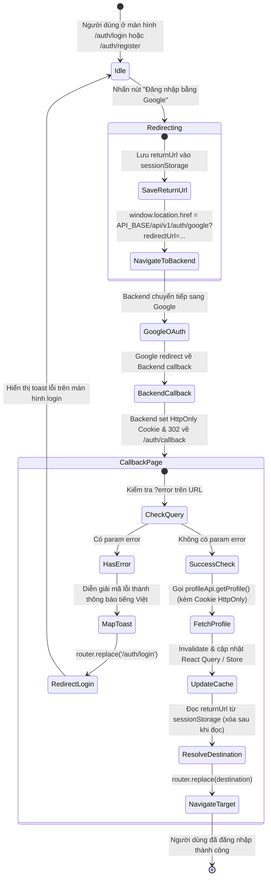

# Data Model & State Specifications: Đăng nhập Google (Frontend Web)

**Feature**: `002-google-login`  
**Date**: 2026-09-25  
**Spec**: [spec.md](./spec.md)

Tài liệu này định nghĩa cấu trúc dữ liệu, trạng thái lưu trữ (state), các type TypeScript và mô hình chuyển đổi trạng thái cho tính năng Đăng nhập Google trên Frontend Web.

---

## 1. Client TypeScript Types

### 1.1. Query Parameters tại Trang Tiếp Nhận (`/auth/callback`)

```typescript
export type GoogleAuthErrorCode =
  | 'access_denied'
  | 'email_unverified'
  | 'email_registered'
  | 'account_linked'
  | 'account_disabled'
  | 'exchange_failed'
  | 'server_error';

export interface GoogleCallbackQueryParams {
  /**
   * Mã lỗi do backend chuyển tiếp từ Google hoặc phát sinh trong quá trình xử lý OAuth
   */
  error?: GoogleAuthErrorCode | string;
}
```

### 1.2. Dữ liệu Hồ sơ Người Dùng (`UserProfile`)

Nhận từ endpoint `GET /api/v1/me` (hoặc `profileApi.getProfile()`) sau khi xác nhận phiên thành công:

```typescript
export interface AuthUserSession {
  userId: string;
  email: string;
  fullName: string;
  avatarUrl?: string | null;
  roleSlug: 'user' | 'admin' | string;
  status: 'active' | 'inactive' | 'pending';
}
```

### 1.3. Cấu trúc Quản lý Ngữ cảnh Trang đích (`SessionStorageState`)

```typescript
export const AUTH_RETURN_URL_KEY = 'closy_auth_return_url';

export interface AuthRedirectContext {
  /**
   * Đường dẫn nội bộ người dùng muốn truy cập sau khi hoàn tất đăng nhập
   * Ràng buộc: Bắt đầu bằng "/", không bắt đầu bằng "//"
   */
  returnUrl?: string;
}
```

---

## 2. Vòng Đời Trạng Thái Xác Thực (State Transitions)



---

## 3. Quy Tắc Xác Thực Dữ Liệu (Validation Rules)

1. **Kiểm tra tính an toàn của `returnUrl`**:
   - `isValidReturnUrl(url: string): boolean`:
     - Bắt buộc bắt đầu bằng ký tự `/` (`url.startsWith('/')`).
     - Không được bắt đầu bằng `//` (ngăn chặn bypass protocol-relative URL `//evil.com`).
     - Không chứa ký tự điều khiển hoặc scheme `javascript:`, `data:`.
     - Nếu không thỏa mãn, bỏ qua và dùng fallback mặc định (`/brands` hoặc `/admin/dashboard`).

2. **Ánh xạ mã lỗi an toàn**:
   - Bất kỳ mã lỗi lạ nào không nằm trong `GoogleAuthErrorCode` đều được hiển thị thông báo an toàn: *"Đăng nhập Google không thành công. Vui lòng thử lại."*
