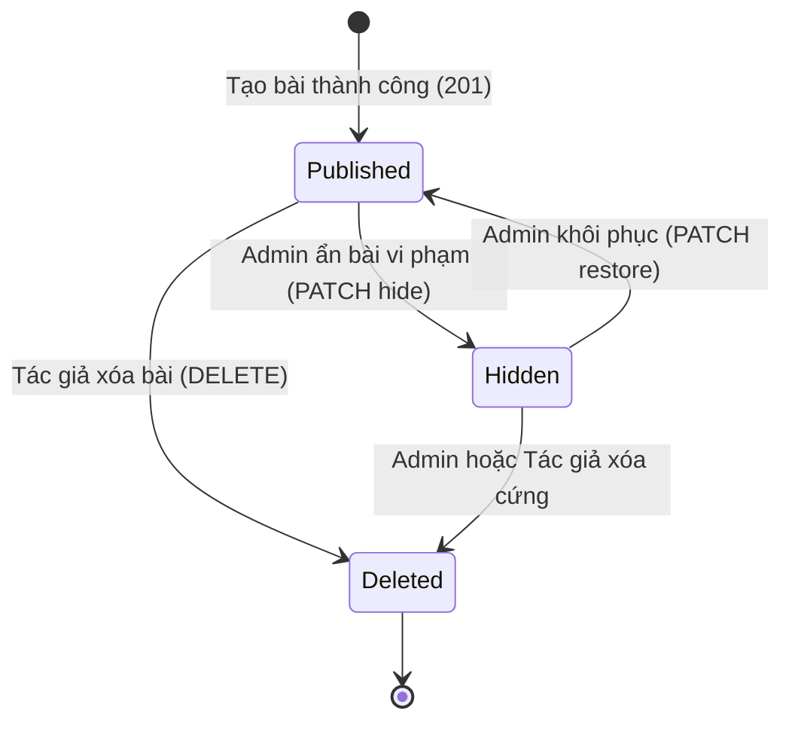
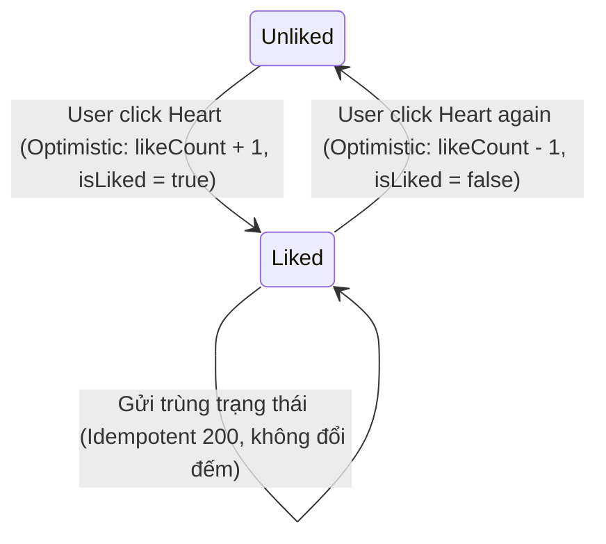
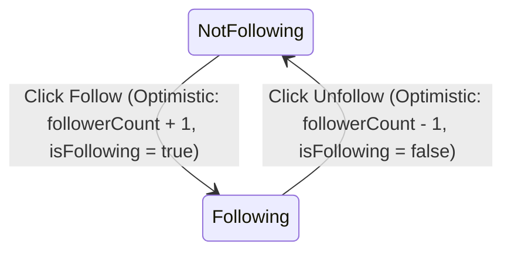

# Data Model: 022 Community Social Frontend Integration

**Feature**: `022-community-social`
**Created**: 2026-09-26
**Status**: Ready

## 1. Core Data Entities

### 1.1 Community User (`CommunityUserRes`)
Đại diện cho thông tin hồ sơ của người dùng trong hệ sinh thái mạng xã hội cộng đồng.

```typescript
export interface CommunityUserRes {
  userId: string;
  username: string;
  firstName?: string;
  lastName?: string;
  avatarUrl?: string; // omitempty: có thể vắng khi người dùng chưa đặt avatar
  gender?: number;    // omitempty: 1 = Nam, 2 = Nữ, 3 = Khác; vắng khi không xác định (0)
}
```

### 1.2 Outfit Brief (`OutfitBriefRes`)
Bộ trang phục tóm tắt được liên kết vào bài đăng thời trang khi `postType = 'outfit'`.

```typescript
export interface OutfitBriefRes {
  id: string;
  name: string;
  coverImageUrl?: string;
}
```

### 1.3 Post Media (`PostMediaRes` & `PostMediaReq`)
Hình ảnh hoặc video đính kèm bài viết.

```typescript
export interface PostMediaRes {
  id: string;
  mediaType: 'image' | 'video';
  mediaUrl: string;
  publicId?: string;
  sortOrder: number;
}

export interface PostMediaReq {
  mediaType: 'image' | 'video';
  mediaUrl: string;
  publicId?: string;
  sortOrder: number;
}
```

### 1.4 Post Entity (`PostRes`)
Bài viết chia sẻ phong cách thời trang trên bảng tin cộng đồng.

```typescript
export interface PostRes {
  id: string;
  publicId: string;
  user: CommunityUserRes;           // Thông tin tác giả dạng đối tượng lồng (Breaking)
  postType: 'outfit' | 'media';     // Chuẩn hóa chữ thường
  status: 'published' | 'hidden' | 'deleted'; // Trạng thái bài đăng
  title?: string | null;            // Tối đa 150 ký tự
  content: string;                  // Tối đa 5000 ký tự
  outfit?: OutfitBriefRes | null;   // Có khi postType = 'outfit'
  likeCount: number;
  commentCount: number;
  isLiked: boolean;
  isFollowingAuthor: boolean;       // Luôn false nếu viewer là tác giả
  sharePath: string;                // Ví dụ: "/community/posts/{publicId}"
  media?: PostMediaRes[];           // Tối đa 10 phần tử
  createdAt: string;
  updatedAt: string;
}
```

### 1.5 Comment Entity (`CommentRes`)
Bình luận và phản hồi phân cấp theo bài viết.

```typescript
export interface CommentRes {
  id: string;                       // UUID nội bộ của bình luận
  user: CommunityUserRes;           // Thông tin người bình luận dạng đối tượng lồng
  content: string;                  // Tối đa 1000 ký tự; rỗng khi isDeleted = true mà còn câu trả lời
  parentCommentId?: string | null;  // Vắng key khi là bình luận gốc
  replyCount: number;               // Số phản hồi con (chỉ có ở gốc, con = 0)
  isDeleted: boolean;               // True khi bình luận đã bị xóa
  createdAt: string;
}
```

### 1.6 Public Profile & Follow (`PublicProfileRes` & `FollowUserRes`)
Hồ sơ công khai và quan hệ theo dõi giữa các thành viên.

```typescript
export interface PublicProfileStats {
  followerCount: number;
  followingCount: number;
  postCount: number;
}

export interface PublicProfileRes {
  user: CommunityUserRes;
  stats: PublicProfileStats;
  isFollowing: boolean;
  isMe: boolean;
}

export interface FollowUserRes {
  user: CommunityUserRes;
  relation: 'following' | 'follower';
  followedAt: string;
}
```

### 1.7 Search Result (`SearchRes`)
Kết quả tìm kiếm tập trung từ máy chủ.

```typescript
export interface SearchRes {
  users: PaginationResult<CommunityUserRes>;
  posts: PaginationResult<PostRes>;
}
```

### 1.8 Admin Entities (`AdminPostRes` & `AdminCommentRes`)
Bản ghi dùng cho bảng điều khiển kiểm duyệt nội dung của quản trị viên.

```typescript
export interface AdminPostRes extends PostRes {
  moderatedBy?: string;             // UUID quản trị viên xử lý
  hiddenReason?: string;            // Ví dụ: "author_disabled", "violation"
}

export interface AdminCommentRes extends CommentRes {
  postId: string;                   // UUID bài đăng chứa bình luận
  status: 'published' | 'hidden' | 'deleted';
}
```

---

## 2. Request Payloads

```typescript
export interface CreatePostReq {
  postType: 'outfit' | 'media';
  title?: string;
  content: string;
  outfitId?: string;                // Bắt buộc khi postType = 'outfit'
  media?: PostMediaReq[];           // 1 - 10 phần tử khi postType = 'media' nếu content rỗng
}

export interface UpdatePostReq {
  title?: string;
  content: string;
  outfitId?: string;
  media?: PostMediaReq[];
  // Không có postType: cấm đổi loại bài viết sau khi tạo
}

export interface AddCommentReq {
  content: string;                  // 1 - 1000 ký tự sau trim
  parentCommentId?: string;         // UUID bình luận gốc nếu là phản hồi
}

export interface LikePostReq {
  isLiked: boolean;
}

export interface FollowReq {
  isFollowing: boolean;
}

export interface UploadSignatureResult {
  signature: string;
  timestamp: number;
  apiKey: string;
  publicId: string;
  folder: string;
  resourceType: 'image' | 'video';  // Xác định endpoint Cloudinary upload
}
```

---

## 3. State Transitions & Lifecycle

### 3.1 Post Lifecycle

- Khi ở trạng thái `hidden`:
  - Khách và người dùng khác: Nhận 404 (bài viết không hiển thị trong search/feed người khác).
  - Tác giả: Nhận 200 kèm `status='hidden'` và hiển thị huy hiệu cảnh báo trên thẻ bài viết.

### 3.2 Like State Machine


### 3.3 Follow State Machine


### 3.4 Comment Lifecycle & Display Rule
- Bình luận gốc bị xóa mà **còn phản hồi con**: Giữ nguyên thẻ với `isDeleted = true`, hiển thị nội dung: *"Bình luận đã bị xóa"*.
- Bình luận bị xóa mà **không còn phản hồi con**: Bị lược bỏ hoàn toàn khỏi danh sách mảng trả về từ máy chủ.

---

## 4. Client Validation Rules Summary

| Trường dữ liệu | Ràng buộc kỹ thuật | Thông báo phản hồi UI |
|---|---|---|
| `title` | Tối đa 150 ký tự | "Tiêu đề không được vượt quá 150 ký tự." |
| `content` (Bài viết) | Tối đa 5000 ký tự | "Nội dung bài viết không được vượt quá 5000 ký tự." |
| `content` (Bình luận) | 1 - 1000 ký tự (sau trim) | "Vui lòng nhập bình luận từ 1 đến 1000 ký tự." |
| `postType = 'outfit'` | `outfitId` không được trống | "Vui lòng chọn một bộ trang phục từ tủ đồ của bạn." |
| `postType = 'media'` | `content` ≠ "" HOẶC `media.length >= 1` | "Bài viết phải có ít nhất lời chia sẻ hoặc 1 hình ảnh/video." |
| Tệp hình ảnh | ≤ 10 MB, định dạng jpg, png, webp | "Kích thước ảnh tối đa là 10MB." |
| Tệp video | ≤ 100 MB, thời lượng ≤ 60s, mp4/webm | "Video không được vượt quá 100MB và thời lượng 60 giây." |
| Số lượng media | Tối đa 10 tệp / bài viết | "Mỗi bài viết chỉ được đính kèm tối đa 10 tệp phương tiện." |
