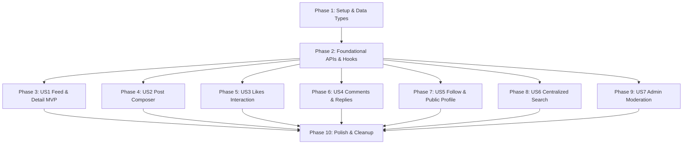

# Tasks: 022 Community Social Frontend Integration

**Feature**: `022-community-social`
**Spec**: [spec.md](./spec.md) | **Plan**: [plan.md](./plan.md) | **Contracts**: [contracts/community-api-contract.md](./contracts/community-api-contract.md)

---

## Phase 1: Setup & Data Contracts (Shared Infrastructure)

**Purpose**: Cập nhật toàn bộ hệ thống kiểu dữ liệu TypeScript, chuẩn hóa enums chữ thường, và dọn dẹp các trường bán hàng/resale cũ khỏi dự án.

- [X] T001 [P] Cập nhật kiểu dữ liệu TypeScript cốt lõi cho Community (`CommunityUserRes`, `OutfitBriefRes`, `PostMediaRes`, `PostRes`, `CommentRes`, `FollowUserRes`, `PublicProfileRes`, `SearchRes`, `CreatePostReq`, `UpdatePostReq`, `UploadSignatureResult`) và loại bỏ hoàn toàn các types liên quan đến resale (`PostItemRes`, `PostItemInputReq`, `WardrobeItemRes`) trong `src/features/community/types/index.ts`
- [X] T002 [P] Cập nhật hàm tiện ích tải ảnh/video `uploadToCloudinary` để nhận thêm tham số `resourceType: 'image' | 'video'` và trỏ đúng URL endpoint Cloudinary `https://api.cloudinary.com/v1_1/{cloud}/{resourceType}/upload` trong `src/lib/cloudinary.ts`
- [X] T003 [P] Tạo các hàm tiện ích phòng thủ và kiểm tra hợp lệ client-side (`validateMediaFile`, `getCommunityUserAvatar`, `getCommunityUserDisplayName`, `formatGenderLabel`) trong `src/features/community/utils/community.utils.ts`

---

## Phase 2: Foundational (API Services & Query Hooks)

**Purpose**: Xây dựng tầng giao tiếp mạng và các TanStack Query Hooks nền tảng dùng chung cho tất cả user stories.

**⚠️ CRITICAL**: Phải hoàn thành giai đoạn này trước khi triển khai các User Stories.

- [X] T004 [P] Cập nhật dịch vụ API `communityApi` trong `src/features/community/api/community.api.ts`:
  - `getCommunityPosts`: hỗ trợ params `type: 'explore' | 'following'`, `sort: 'hot' | 'latest'`, `postType: 'outfit' | 'media'`, `username`, `page`, `limit`
  - `getPostUploadSignature`: nhận `resourceType?: 'image' | 'video'`
  - `getPostLikes`: gọi `GET /posts/{publicId}/likes` trả về `PaginationResult<CommunityUserRes>`
  - `updatePost`: gọi `PUT /posts/{publicId}` với `UpdatePostReq`
- [X] T005 [P] Tạo mới dịch vụ API người dùng mạng xã hội `userSocialApi` (`followUser`, `getPublicProfile`, `getUserPosts`, `getUserFollows`) trong `src/features/community/api/user-social.api.ts`
- [X] T006 [P] Tạo mới dịch vụ API tìm kiếm cộng đồng `searchApi` (`searchCommunity`) gọi `GET /search?q=&type=all|users|posts&postType=&page=&limit=` trong `src/features/community/api/search.api.ts`
- [X] T007 [P] Cập nhật các Query Keys và Hooks cơ bản (`useInfiniteCommunity`, `usePostDetail`, `usePostComments`, `useCommentReplies`, `usePostLikes`) trong `src/features/community/queries/community.queries.ts`
- [X] T008 [P] Tạo các Query Hooks cho hồ sơ mạng xã hội (`usePublicProfile`, `useUserPosts`, `useUserFollows`, `useFollowUser`) trong `src/features/community/queries/user-social.queries.ts`
- [X] T009 [P] Tạo Query Hook tìm kiếm tập trung (`useCommunitySearch`) trong `src/features/community/queries/search.queries.ts`

**Checkpoint**: Tầng Foundation hoàn tất - các User Stories có thể bắt đầu triển khai độc lập.

---

## Phase 3: User Story 1 - Khám phá bảng tin & Xem chi tiết bài đăng (Priority: P1) 🎯 MVP

**Goal**: Người dùng duyệt bảng tin với tab Explore/Following, lọc Hot/Latest, hiển thị bài đăng đúng loại `outfit` (ảnh bìa outfit) hoặc `media` (ảnh/video), và xem trang chi tiết bài viết.

**Independent Test**: Mở `/community`, chuyển tab Khám phá/Đang theo dõi, chuyển sort Nổi bật/Mới nhất, nhấn vào bài viết để vào trang chi tiết `/posts/[postPublicId]` và kiểm tra hiển thị thông tin tác giả từ `post.user`.

- [X] T010 [P] [US1] Tạo thành phần phát video `VideoPlayer.tsx` hỗ trợ tự động phát có kiểm soát, nút bật/tắt tiếng và điều khiển phát trong `src/features/community/components/VideoPlayer.tsx`
- [X] T011 [US1] Cập nhật thẻ bài viết `PostCard.tsx`:
  - Đọc thông tin tác giả phòng thủ từ `post.user.username`, `post.user.avatarUrl`
  - Hiển thị bài dạng `outfit` với ảnh bìa `post.outfit?.coverImageUrl` và thẻ thông tin trang phục
  - Hiển thị bài dạng `media` với ảnh `post.media` hoặc `VideoPlayer` khi `mediaType === 'video'`
  - Hiển thị huy hiệu cảnh báo "Đang bị ẩn kiểm duyệt" khi bài viết có `post.status === 'hidden'`
  - Bổ sung liên kết điều hướng trực tiếp sang trang chi tiết bài viết `/posts/${post.publicId}` khi nhấn vào ảnh hoặc tiêu đề
  - Cập nhật trong `src/features/community/components/PostCard.tsx`
- [X] T012 [US1] Cập nhật danh sách bảng tin `CommunityList.tsx` bổ sung thanh điều khiển Tab (`Khám phá` / `Đang theo dõi`) và Dropdown sắp xếp (`Nổi bật` / `Mới nhất`), truyền các tham số lọc vào `useInfiniteCommunity` trong `src/features/community/components/CommunityList.tsx`
- [X] T013 [US1] Cập nhật trang chi tiết bài viết `PostDetailClient.tsx` và `PostData.tsx`:
  - Đọc dữ liệu từ `post.user.*`, loại bỏ toàn bộ mock fallback và kết nối trực tiếp `serverFetch<PostRes>(/posts/${postPublicId})`
  - Cập nhật hàm `generateMetadata` trong `src/app/(user)/posts/[postPublicId]/page.tsx`
  - Cập nhật `src/app/(user)/posts/[postPublicId]/components/PostData.tsx` và `src/app/(user)/posts/[postPublicId]/components/PostDetailClient.tsx`
- [X] T014 [US1] Tạo trang chuyển hướng `src/app/(user)/community/posts/[postPublicId]/page.tsx` để redirect tự động về `/posts/[postPublicId]`, đảm bảo tính tương thích tuyệt đối với `sharePath` từ backend

**Checkpoint**: User Story 1 hoàn tất - Bảng tin cộng đồng và Chi tiết bài đăng hoạt động trơn tru với dữ liệu backend thực tế.

---

## Phase 4: User Story 2 - Soạn thảo và chia sẻ bài đăng thời trang (Priority: P1)

**Goal**: Cho phép người dùng đăng bài gắn với bộ trang phục từ tủ đồ cá nhân (`postType='outfit'`) hoặc tải lên từ 1 đến 10 ảnh/video (`postType='media'`), kèm tiêu đề và nội dung.

**Independent Test**: Mở trình tạo bài viết, chọn một bộ trang phục từ tủ đồ để đăng bài; thử đăng một bài viết khác có đính kèm video; kiểm tra bài viết xuất hiện ngay trên đầu feed.

- [X] T015 [P] [US2] Tạo modal chọn trang phục từ tủ đồ `OutfitPickerModal.tsx` tích hợp hook `useOutfits()` để hiển thị danh sách trang phục dạng lưới chọn kèm tìm kiếm trong `src/features/community/components/OutfitPickerModal.tsx`
- [X] T016 [US2] Xây dựng modal soạn thảo bài viết `PostComposerModal.tsx`:
  - Chuyển đổi giữa 2 tab: "Trang phục (Outfit)" và "Hình ảnh & Video (Media)"
  - Khi chọn Outfit: bắt buộc chọn từ `OutfitPickerModal`, hiển thị thẻ preview trang phục đã chọn
  - Khi chọn Media: hỗ trợ chọn và xem trước tối đa 10 ảnh hoặc video, kiểm tra dung lượng (ảnh ≤ 10MB, video ≤ 100MB/60s)
  - Kiểm tra độ dài: `title` ≤ 150 ký tự, `content` ≤ 5000 ký tự
  - Tích hợp gọi `communityApi.getPostUploadSignature({ resourceType })` và upload song song lên Cloudinary
  - Đăng bài qua mutation `useCreatePost` (hoặc `useUpdatePost` khi chỉnh sửa)
  - Cập nhật trong `src/features/community/components/PostComposerModal.tsx`
- [X] T017 [US2] Tích hợp `PostComposerModal` vào `CommunityList.tsx` thay thế form inline cũ, bổ sung nút mở modal tạo bài viết trong `src/features/community/components/CommunityList.tsx`
- [X] T018 [US2] Bổ sung nút "Chỉnh sửa bài viết" trên menu `PostCard.tsx` cho phép tác giả cập nhật lại tiêu đề, nội dung và danh sách media của bài đăng trong `src/features/community/components/PostCard.tsx`

**Checkpoint**: User Story 2 hoàn tất - Người dùng có thể sáng tạo và xuất bản cả 2 định dạng bài đăng thời trang.

---

## Phase 5: User Story 3 - Tương tác Thích & Xem danh sách người thích (Priority: P2)

**Goal**: Cung cấp phản hồi tức thì khi Thích/Bỏ thích bài đăng qua Optimistic Update và cho phép mở modal xem danh sách người dùng đã thích bài viết.

**Independent Test**: Bấm nút Tim trên bài viết, số lượt thích và trạng thái icon đổi màu ngay lập tức (< 100ms); bấm vào số lượt thích mở modal danh sách phân trang người dùng đã thích.

- [X] T019 [US3] Cập nhật mutation `useLikePost` trong `src/features/community/queries/community.queries.ts`:
  - Triển khai Optimistic Update đồng bộ trên mọi cache trang của `feed` query và `detail` query
  - Rollback an toàn khi có lỗi mạng hoặc mã lỗi 429
- [X] T020 [P] [US3] Xây dựng component `PostLikesModal.tsx` hiển thị danh sách phân trang người dùng đã thích bài viết (`PaginationResult<CommunityUserRes>`) kèm ảnh đại diện, họ tên, giới tính và nút điều hướng tới hồ sơ trong `src/features/community/components/PostLikesModal.tsx`
- [X] T021 [US3] Tích hợp nút mở `PostLikesModal` khi người dùng bấm vào dòng số lượt thích trên `PostCard.tsx` trong `src/features/community/components/PostCard.tsx`

**Checkpoint**: User Story 3 hoàn tất - Trải nghiệm thả tim mượt mà và xem danh sách tương tác đầy đủ.

---

## Phase 6: User Story 4 - Thảo luận và trao đổi qua bình luận phân cấp (Priority: P2)

**Goal**: Hỗ trợ thảo luận đa cấp (gốc & câu trả lời con), chỉnh sửa bình luận tại chỗ, và xử lý hiển thị nhãn "Bình luận đã bị xóa" khi bình luận gốc bị xóa nhưng vẫn còn phản hồi con.

**Independent Test**: Gửi bình luận gốc, gửi câu trả lời con, sửa nội dung bình luận, xóa bình luận gốc có phản hồi và xác nhận nhãn "Bình luận đã bị xóa" hiển thị đúng.

- [X] T022 [US4] Cập nhật `CommentItem.tsx`:
  - Đọc thông tin người bình luận phòng thủ từ `comment.user.username`, `comment.user.avatarUrl`
  - Kiểm tra `comment.isDeleted`: nếu `true`, hiển thị thông báo chữ nghiêng *"Bình luận này đã bị xóa"* và ẩn các nút sửa/xóa/trả lời
  - Hiển thị số lượng phản hồi con từ `comment.replyCount`
  - Hỗ trợ chỉnh sửa inline và xóa bình luận
  - Cập nhật trong `src/features/community/components/CommentItem.tsx`
- [X] T023 [US4] Cập nhật `PostCommentsModal.tsx`:
  - Đọc thông tin tác giả bài viết từ `post.user.*`
  - Đảm bảo hiển thị danh sách bình luận gốc theo thứ tự mới nhất trước
  - Cập nhật trong `src/features/community/components/PostCommentsModal.tsx`
- [X] T024 [US4] Cập nhật các mutations `useAddComment`, `useUpdateComment`, `useDeleteComment` trong `src/features/community/queries/community.queries.ts` để đồng bộ chính xác số đếm `commentCount` trên bài viết

**Checkpoint**: User Story 4 hoàn tất - Hệ thống bình luận lồng cấp vận hành mượt mà và bảo toàn mạch thảo luận.

---

## Phase 7: User Story 5 - Theo dõi tác giả & Trang cá nhân công khai (Priority: P3)

**Goal**: Hỗ trợ nút Follow/Unfollow tác giả với Optimistic Update và xây dựng trang cá nhân công khai `/users/[username]` hiển thị chỉ số, bài viết và danh sách quan hệ theo dõi.

**Independent Test**: Bấm Follow trên thẻ bài viết; truy cập `/users/[username]` để xem trang cá nhân của tác giả; mở modal danh sách followers/following và tìm kiếm theo tên.

- [X] T025 [P] [US5] Xây dựng component `FollowButton.tsx` tích hợp mutation `useFollowUser`:
  - Tự động ẩn khi người xem chính là tác giả (`post.user.userId === currentUser.id` hoặc `isMe === true`)
  - Cập nhật lạc quan trạng thái nút giữa "Theo dõi" và "Đang theo dõi"
  - Đặt tại `src/features/community/components/FollowButton.tsx`
- [X] T026 [US5] Tích hợp `FollowButton` vào header thẻ bài viết `PostCard.tsx` trong `src/features/community/components/PostCard.tsx`
- [X] T027 [P] [US5] Xây dựng modal danh sách quan hệ theo dõi `UserFollowsModal.tsx` hỗ trợ xem tab "Người theo dõi" (Followers) hoặc "Đang theo dõi" (Following), tích hợp ô tìm kiếm lọc theo username/họ tên trong `src/features/community/components/UserFollowsModal.tsx`
- [X] T028 [US5] Xây dựng trang cá nhân công khai `/users/[username]`:
  - Server Component lấy dữ liệu ban đầu: `src/app/(user)/users/[username]/page.tsx`
  - Client View `UserProfileClient.tsx` hiển thị Header hồ sơ, các chỉ số thống kê (posts, followers, following), nút Follow/Edit Profile
  - Lưới bài viết của người dùng `UserPostsGrid.tsx` (hiển thị bài viết của tác giả, nếu là chính mình thì thấy cả bài có `status === 'hidden'`)
  - Đặt tại `src/app/(user)/users/[username]/`

**Checkpoint**: User Story 5 hoàn tất - Đồ thị mạng xã hội người theo dõi và trang cá nhân hoạt động hoàn chỉnh.

---

## Phase 8: User Story 6 - Tìm kiếm nội dung bài đăng và người dùng (Priority: P3)

**Goal**: Nâng cấp trang `/search` kết nối endpoint tập trung `GET /search?q=...` để phân tách hai khối kết quả: Người dùng phù hợp và Bài viết thời trang trong 30 ngày.

**Independent Test**: Truy cập `/search`, nhập từ khóa, kiểm tra kết quả trả về đúng hai tab/khối "Mọi người" và "Bài viết", kiểm tra chuyển trang phân trang độc lập cho từng khối.

- [X] T029 [US6] Tái cấu trúc thành phần `SearchClient.tsx` trong `src/app/(user)/search/components/SearchClient.tsx`:
  - Tích hợp hook `useCommunitySearch({ q, type, postType, page, limit })`
  - Hiển thị thanh tab chuyển đổi: "Tất cả", "Người dùng", "Bài viết"
  - Khối Người dùng: danh sách thẻ `CommunityUserRes` kèm nút Follow và link sang `/users/[username]`
  - Khối Bài viết: hiển thị dạng lưới các bài viết `PostCard` khớp từ khóa
  - Quản lý phân trang riêng cho `users.metadata` và `posts.metadata`

**Checkpoint**: User Story 6 hoàn tất - Khả năng tìm kiếm người dùng và bài đăng trên toàn hệ thống đạt hiệu quả cao.

---

## Phase 9: User Story 7 - Quản trị và kiểm duyệt nội dung cộng đồng (Priority: P4)

**Goal**: Cung cấp giao diện cho Quản trị viên kiểm duyệt danh sách bài viết và bình luận, thực hiện thao tác ẩn nội dung vi phạm hoặc khôi phục lại nội dung.

**Independent Test**: Đăng nhập quyền Admin, truy cập `/admin/moderation`, thực hiện ẩn 1 bài viết và khôi phục lại 1 bình luận vi phạm.

- [X] T030 [P] [US7] Tạo dịch vụ API quản trị kiểm duyệt `adminCommunityApi` trong `src/features/admin/api/community-admin.api.ts` và các hooks `useAdminPosts`, `useAdminComments`, `useAdminHidePost`, `useAdminRestorePost`, `useAdminHideComment`, `useAdminRestoreComment` trong `src/features/admin/queries/community-admin.queries.ts`
- [X] T031 [US7] Cập nhật bảng kiểm duyệt bài viết `AdminPostsModeration.tsx` đọc `post.user.*`, loại bỏ hoàn toàn tab `post-items`, và bổ sung nút thao tác Ẩn (`PATCH hide`) / Khôi phục (`PATCH restore`) trong `src/app/admin/moderation/components/AdminPostsModeration.tsx`
- [X] T032 [P] [US7] Xây dựng bảng kiểm duyệt bình luận `AdminCommentsModeration.tsx` cho phép xem danh sách bình luận toàn sàn, lọc theo từ khóa/trạng thái và thực hiện Ẩn/Khôi phục trong `src/app/admin/moderation/components/AdminCommentsModeration.tsx`

**Checkpoint**: User Story 7 hoàn tất - Hệ thống kiểm duyệt nội dung quản trị viên sẵn sàng vận hành.

---

## Phase 10: Polish & Cross-Cutting Concerns

**Purpose**: Dọn dẹp mock data, kiểm tra định dạng lỗi tiếng Việt và kiểm tra toàn bộ luồng tích hợp trước khi bàn giao.

- [X] T033 Dọn dẹp code mock: Khôi phục kết nối API gốc tại `src/app/(user)/community/components/CommunityData.tsx` và `src/app/(user)/community/components/CommunityClient.tsx`, xóa bỏ mock fallback
- [X] T034 Cập nhật xử lý lỗi API tập trung trong `src/lib/api-error.ts` để hiển thị tiếng Việt cho các mã lỗi 400 (Validation), 401 (Yêu cầu đăng nhập), 403 (Không có quyền), 404 (Không tìm thấy) và 429 (Thao tác quá nhanh, thử lại sau)
- [X] T035 [P] Cập nhật liên kết chuyển hướng menu Sidebar (`src/components/layout/sidebar.tsx`) và Guest Header (`src/components/layout/guest-header.tsx`) trỏ chuẩn xác đến `/community`
- [X] T036 Chạy kiểm thử TypeScript toàn dự án (`npx tsc --noEmit`) và chạy kiểm thử đơn vị (`npm test`) đảm bảo không có bất kỳ lỗi biên dịch nào

---

## Dependencies & Execution Order

---

## Implementation Strategy: MVP First

1. **Bước 1**: Hoàn thành **Phase 1** & **Phase 2** (Các types TypeScript và API client chuẩn).
2. **Bước 2**: Hoàn thành **Phase 3 (User Story 1 - MVP)**:
   - Hiển thị bảng tin Explore / Following.
   - Thẻ bài viết đọc `post.user` và hiển thị ảnh bìa Outfit hoặc Video.
   - Chi tiết bài viết `/posts/[postPublicId]`.
   - **Xác nhận MVP hoạt động độc lập và ổn định**.
3. **Bước 3**: Triển khai nối tiếp theo thứ tự ưu tiên:
   - Phase 4 (US2 - Tạo bài viết Outfit & Media).
   - Phase 5 (US3 - Thả tim & xem likes).
   - Phase 6 (US4 - Bình luận phân cấp).
   - Phase 7 (US5 - Theo dõi & Profile `/users/[username]`).
   - Phase 8 (US6 - Tìm kiếm `/search`).
   - Phase 9 (US7 - Kiểm duyệt Admin).
   - Phase 10 (Dọn dẹp mock data và kiểm thử toàn diện).
