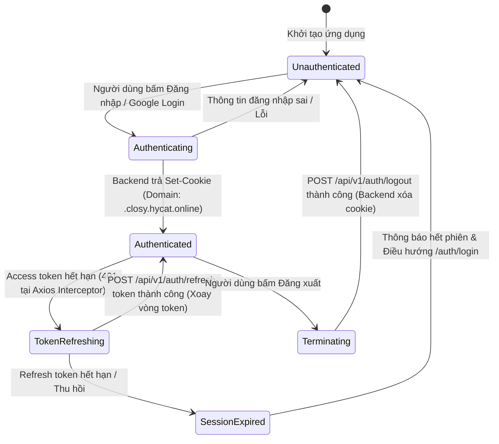

# Data Model & State Transitions: Hiển thị Hạn mức Profile & Chuẩn hoá Quản lý Phiên Cookie Auth

**Feature**: `023-profile-limits-auth-session`  
**Date**: 2026-09-26  
**Status**: Draft  

---

## 1. Mô hình Dữ liệu (Entities & TypeScript Types)

### 1.1. `DailyQuota` (Dữ liệu Hạn mức & Sử dụng theo Ngày từ Backend)

Được trả về từ `GET /api/v1/subscriptions/me/daily-quota`.

```typescript
export interface DailyQuota {
  // Định danh & Thông tin gói
  planID?: string;
  PlanID?: string;
  planName?: string;
  PlanName?: string;
  planSlug?: string;
  PlanSlug?: string;
  expiresAt?: string;
  ExpiresAt?: string;
  isAutoRenewEnabled?: boolean;
  IsAutoRenewEnabled?: boolean;

  // Hạn mức tổng thể của gói (0 hoặc undefined = Không giới hạn)
  maxWardrobeItems?: number;
  MaxWardrobeItems?: number;
  maxOutfits?: number;
  MaxOutfits?: number;

  // Hạn ngạch hàng ngày tính năng AI (0 hoặc undefined = Không giới hạn)
  aiOutfitDailyQuota?: number;
  AiOutfitDailyQuota?: number;
  aiChatDailyQuota?: number;
  AiChatDailyQuota?: number;

  // Số lượt AI đã sử dụng trong ngày
  outfitRecommendCount?: number;
  OutfitRecommendCount?: number;
  aiUsageCount?: number;
  AiUsageCount?: number;

  // Thời điểm reset hạn ngạch gần nhất
  lastResetDate?: string;
  LastResetDate?: string;
}
```

### 1.2. `WardrobeStats` (Số lượng Tài nguyên Thực tế Đã Dùng)

Được trả về từ `GET /api/v1/me/wardrobe-items/stats`.

```typescript
export interface WardrobeStats {
  // Tổng số món đồ đang hoạt động trong tủ đồ
  activeItemsCount: number;

  // Tổng số bộ phối đồ (outfit) đã lưu
  outfitsCount: number;
}
```

### 1.3. `DisplayPlanQuota` (UI Aggregate Model cho `CurrentPlanCard`)

Mô hình dữ liệu đã qua chuẩn hóa và tính toán sẵn để cung cấp cho giao diện hiển thị:

```typescript
export interface QuotaItemDisplay {
  current: number;
  max: number;
  isUnlimited: boolean;
  percentage: number;
  displayLimit: string;    // Ví dụ: "128 / 500 món" hoặc "128 / ∞ món"
  showProgressBar: boolean;
}

export interface CurrentPlanDisplayData {
  wardrobeItems: QuotaItemDisplay;
  outfits: QuotaItemDisplay;
  aiOutfitRecommend: QuotaItemDisplay;
  aiChat: QuotaItemDisplay;
}
```

**Quy tắc biến đổi dữ liệu (Mapping Rules)**:
```typescript
function buildQuotaItemDisplay(currentRaw?: number, maxRaw?: number, unit?: string): QuotaItemDisplay {
  const current = currentRaw ?? 0;
  const isUnlimited = maxRaw === 0 || maxRaw === undefined || maxRaw === null;
  const max = isUnlimited ? 0 : maxRaw;
  const percentage = isUnlimited ? 0 : Math.min(100, Math.max(0, (current / max) * 100));
  const displayLimit = isUnlimited ? `${current} / ∞${unit ? ` ${unit}` : ''}` : `${current} / ${max}${unit ? ` ${unit}` : ''}`;

  return {
    current,
    max,
    isUnlimited,
    percentage,
    displayLimit,
    showProgressBar: !isUnlimited,
  };
}
```

---

## 2. Mô hình Phiên & Thuộc tính Cookie Auth (`AuthCookieEntity`)

Backend là nguồn duy nhất kiểm soát việc set và xóa các cookie này:

| Tên Cookie | Mục đích | Scope Domain | HttpOnly | SameSite | Secure | Max-Age |
|---|---|---|---|---|---|---|
| `accessToken` | Xác thực truy cập ngắn hạn | `.closy.hycat.online` | `true` | `Strict` / `Lax` (Google) | `true` | ~15 phút |
| `refreshToken` | Xoay vòng và cấp mới access token | `.closy.hycat.online` | `true` | `Strict` / `Lax` (Google) | `true` | ~7 ngày |
| `forgotPasswordToken` | Xác thực tạm luồng reset password | `.closy.hycat.online` | `true` | `Strict` | `true` | ~10 phút |

**Ràng buộc bảo mật**:
- Tuyệt đối không lưu token vào `localStorage`, `sessionStorage` hay biến JavaScript toàn cục.
- Phía Frontend Client và BFF không tự `Set-Cookie` cho bất kỳ cookie nào trong danh sách trên.

---

## 3. Biểu đồ Chuyển trạng thái Phiên Làm việc (Auth State Lifecycle)



---

## 4. Quy tắc Kiểm tra & Xác thực Dữ liệu (Validation Rules)

1. **Hiển thị Số lượng**:
   - Nếu `activeItemsCount = 0` hoặc `outfitsCount = 0`, giá trị hiển thị bắt buộc là `0`, không được để trống hoặc hiển thị fallback `∞`.
2. **Xử lý Mẫu số bằng 0**:
   - Khi `max = 0`, tuyệt đối không thực hiện phép chia `(current / max)`.
   - `showProgressBar` trả về `false` hoặc thanh tiến trình có chiều rộng `w-0` (0%).
3. **Chặn trên Tiến trình (Progress Clamping)**:
   - Nếu số lượng hiện tại vượt quá hạn mức (ví dụ tài khoản bị hạ cấp gói nhưng đồ cũ chưa bị xóa), thanh tiến trình bị giới hạn tối đa ở mức `100%`, đồng thời đổi sang màu cảnh báo (màu vàng/đỏ).
4. **Cô lập Cookie**:
   - Mọi thao tác ghi nhận cookie auth phải có trường `Domain` khớp với cấu hình hệ thống máy chủ; không để xảy ra trường hợp tồn tại 2 bản ghi cùng tên cookie trên trình duyệt.
