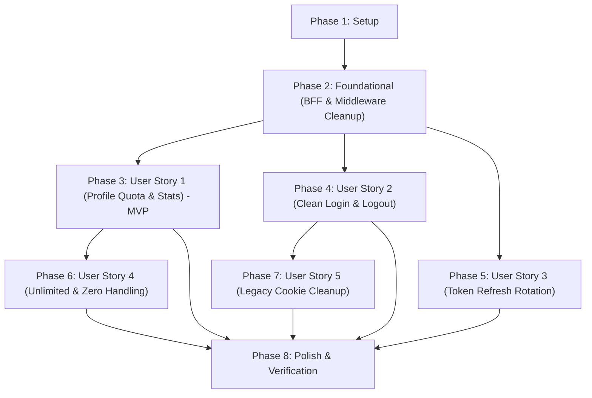

# Implementation Tasks: Hiển thị Hạn mức Profile & Quản lý Phiên Cookie Auth Chuẩn hoá

**Feature**: `023-profile-limits-auth-session` | **Date**: 2026-09-26  
**Spec**: [spec.md](./spec.md) | **Plan**: [plan.md](./plan.md)  
**Status**: Completed  

---

## Phase 1: Setup (Shared Infrastructure)

**Purpose**: Chuẩn bị cấu hình proxy và làm sạch tiện ích cookie dùng chung

- [X] T001 Xác minh cấu hình rewrite proxy backend `/api/v1/:path*` trong `next.config.ts` để đảm bảo chuyển tiếp đầy đủ request và response headers
- [X] T002 Vô hiệu hóa và đánh dấu deprecate các hàm thiết lập cookie không có domain (`accessCookieOptions`, `refreshCookieOptions`, `clearCookieOptions`) trong `src/lib/auth-cookies.ts`

---

## Phase 2: Foundational (Blocking Prerequisites)

**Purpose**: Loại bỏ các điểm phát sinh cookie host-only gây xung đột phiên, chuyển toàn bộ quyền kiểm soát phiên về Backend

**⚠️ CRITICAL**: Không bắt đầu triển khai các User Story liên quan đến xác thực cho đến khi hoàn tất Phase này.

- [X] T003 [P] Xóa các route handler BFF re-export tại `src/app/api/v1/auth/login/route.ts`, `src/app/api/v1/auth/logout/route.ts`, `src/app/api/v1/auth/refresh-token/route.ts`, và `src/app/api/v1/auth/status/route.ts` để Next.js kích hoạt rewrite proxy trực tiếp sang backend
- [X] T004 [P] Xóa các route handler BFF cũ tại `src/app/api/auth/login/route.ts`, `src/app/api/auth/logout/route.ts`, `src/app/api/auth/refresh-token/route.ts`, và `src/app/api/auth/status/route.ts` nhằm triệt tiêu hoàn toàn mã lệnh tự set cookie host-only
- [X] T005 Gỡ bỏ hoàn toàn các lệnh `cookies.set` và `cookies.delete` cho `accessToken` và `refreshToken` (dòng 158-207) cũng như khối gọi refresh token trùng lặp cho page request trong `src/middleware.ts`
- [X] T006 Đảm bảo instance Axios trong `src/lib/axios.ts` luôn bật `withCredentials: true` và trỏ `baseURL: '/api/v1'` cho toàn bộ các request

**Checkpoint**: Nền tảng proxy rewrite và middleware sạch sẵn sàng — các User Story có thể triển khai song song hoặc tuần tự.

---

## Phase 3: User Story 1 - Hiển thị Hạn mức & Thống kê Tủ đồ/Outfit trên `/profile` (Priority: P1) 🎯 MVP

**Goal**: Người dùng theo dõi trực quan và minh bạch số lượng đồ/outfit đã sử dụng so với giới hạn tối đa của gói cước trên trang `/profile`.

**Independent Test**: Đăng nhập bằng tài khoản gói giới hạn (ví dụ: tối đa 500 đồ, 50 outfit); truy cập `/profile`; xác nhận thẻ gói hiển thị chính xác `{activeItemsCount} / {maxWardrobeItems} món` và `{outfitsCount} / {maxOutfits} bộ` kèm thanh đo tiến trình đúng tỷ lệ phần trăm.

### Implementation for User Story 1

- [X] T007 [P] [US1] Bổ sung kiểu dữ liệu `stats?: WardrobeStats` và các trường `maxWardrobeItems`, `maxOutfits` trong `src/features/subscription/types/index.ts`
- [X] T008 [US1] Cập nhật `src/app/(user)/profile/components/ProfileClient.tsx`: thay thế query inline `['subscription', 'quota']` bằng hook chuẩn `useDailyQuota()` (queryKey: `['subscription', 'daily-quota']`), tích hợp hook `useWardrobeStats()`, và truyền `stats` xuống `CurrentPlanCard`
- [X] T009 [US1] Sửa lỗi biểu thức lặp logic tại dòng ~89 (`quota.maxWardrobeItems || quota.maxWardrobeItems`) và cập nhật giao diện hiển thị số lượng hiện tại kèm hạn mức tối đa `{current} / {max}` cho món đồ và outfit trong `src/features/subscription/components/CurrentPlanCard.tsx`
- [X] T010 [US1] Bổ sung thanh tiến trình (progress bar) trực quan cho Tủ đồ và Outfit với công thức `Math.min(100, Math.max(0, (current / max) * 100))` trong `src/features/subscription/components/CurrentPlanCard.tsx`

**Checkpoint**: User Story 1 hoàn tất — người dùng xem được hạn mức và số lượng thực tế chính xác trên Profile.

---

## Phase 4: User Story 2 - Quản lý Phiên Đăng nhập & Đăng xuất Chuẩn hoá (Priority: P1)

**Goal**: Quá trình đăng nhập và đăng xuất chỉ tạo và giải phóng duy nhất một phiên cookie có domain từ backend, chấm dứt hoàn toàn hiện tượng 4 token / 2 domain và đăng xuất sót phiên.

**Independent Test**: Đăng nhập qua `/auth/login` hoặc Google Login; kiểm tra DevTools Application -> Cookies chỉ có đúng 1 `accessToken` và 1 `refreshToken` với Domain `.closy.hycat.online`; nhấn Đăng xuất, xác nhận cả 2 cookie bị xóa sạch và người dùng không thể truy cập lại trang riêng tư.

### Implementation for User Story 2

- [X] T011 [P] [US2] Cập nhật các hàm `login` và `logout` trong `src/features/auth/api/auth.api.ts` để gọi trực tiếp các endpoint `/auth/login` và `/auth/logout` qua Axios với `withCredentials: true` mà không tự can thiệp cookie
- [X] T012 [US2] Rà soát và cập nhật `src/store/useAuthStore.ts` và `src/components/providers/auth-provider.tsx` để đồng bộ trạng thái đăng nhập/đăng xuất dựa trên kết quả phản hồi của API và xác thực hồ sơ `/api/v1/me`, không phụ thuộc vào việc đọc cookie từ JavaScript
- [X] T013 [US2] Kiểm tra và xác nhận luồng tiếp nhận callback Google OAuth tại `src/app/(guest)/auth/callback/components/CallbackClient.tsx` hoạt động đồng bộ với cơ chế cookie phiên mới của backend

**Checkpoint**: User Story 2 hoàn tất — chu trình đăng nhập và đăng xuất sạch sẽ, an toàn, không còn cookie host-only.

---

## Phase 5: User Story 3 - Xoay vòng & Duy trì Phiên Làm việc khi Access Token Hết hạn (Priority: P2)

**Goal**: Tự động xoay vòng cặp token ngầm qua Axios interceptor khi access token hết hạn mà không làm gián đoạn người dùng hoặc sinh thêm token dư thừa.

**Independent Test**: Giả lập hết hạn access token, thực hiện thao tác gửi request, xác nhận Axios interceptor kích hoạt `POST /api/v1/auth/refresh-token`, nhận token mới từ backend và thực hiện lại request thành công mà không đăng xuất người dùng.

### Implementation for User Story 3

- [X] T014 [US3] Cập nhật Axios response interceptor trong `src/lib/axios.ts` để gọi `POST /api/v1/auth/refresh-token` với `{ withCredentials: true }` và chuyển tiếp header `Set-Cookie` xoay vòng của backend
- [X] T015 [US3] Tối ưu hóa hàng đợi `failedQueue` trong `src/lib/axios.ts` để chặn gọi đồng thời nhiều request refresh token khi nhiều API cùng nhận mã lỗi 401
- [X] T016 [US3] Đồng bộ hàm `refreshToken` trong `src/features/auth/api/auth.api.ts` để tương thích với cơ chế refresh token của rewrite proxy

**Checkpoint**: User Story 3 hoàn tất — phiên làm việc được tự động duy trì liền mạch.

---

## Phase 6: User Story 4 - Trải nghiệm Trực quan với Gói Không giới hạn (Unlimited) & Đếm bằng 0 (Priority: P2)

**Goal**: Hiển thị ký hiệu vô cực (`∞`) cho các gói không giới hạn (`max = 0` hoặc undefined), bảo vệ không chia cho 0, và giữ nguyên hiển thị chữ số `0` khi số lượng hiện tại bằng 0.

**Independent Test**: Đăng nhập tài khoản có `maxWardrobeItems = 0` hoặc `maxOutfits = 0`, xác nhận hiển thị `{current} / ∞` và thanh tiến trình không lỗi `NaN%`; đăng nhập tài khoản có 0 đồ, xác nhận hiển thị `0 / {max}`.

### Implementation for User Story 4

- [X] T017 [P] [US4] Xây dựng tiện ích chuẩn hóa hiển thị hạn mức `formatQuotaDisplay` trong `src/features/subscription/utils/quota.ts` xử lý điều kiện `isUnlimited(max)` (`max === 0 || max === undefined || max === null`) và sử dụng nullish coalescing `?? 0`
- [X] T018 [US4] Áp dụng `formatQuotaDisplay` vào `src/features/subscription/components/CurrentPlanCard.tsx` để ẩn hoặc đặt chiều rộng an toàn 0% cho thanh tiến trình khi gói cước là vô cực
- [X] T019 [US4] Đồng bộ cách đọc hạn mức tủ đồ trong `src/app/(user)/wardrobe/components/WardrobeClient.tsx` sang `daily-quota` để đồng nhất hiển thị giữa màn hình tủ đồ và màn hình profile

**Checkpoint**: User Story 4 hoàn tất — các trường hợp đặc biệt (vô cực, 0 món) hiển thị hoàn hảo.

---

## Phase 7: User Story 5 - Tự động Dọn dẹp Cookie Host-only Cũ Xung đột (Priority: P3)

**Goal**: Tự động dọn dẹp các tàn dư cookie host-only cũ trên trình duyệt của người dùng hiện hữu để ngăn ngừa xung đột phiên.

**Independent Test**: Tạo cookie host-only giả lập trên trình duyệt; khởi động lại ứng dụng; xác nhận tàn dư host-only được dọn dẹp sạch sẽ, chỉ giữ lại cookie domain chuẩn.

### Implementation for User Story 5

- [X] T020 [US5] Xây dựng tiện ích dọn dẹp cookie `cleanLegacyHostCookies` trong `src/lib/auth-cleanup.ts` để xóa các cookie host-only non-HttpOnly và kích hoạt dọn dẹp khi đăng xuất
- [X] T021 [US5] Tích hợp gọi `cleanLegacyHostCookies` trong `src/components/providers/auth-provider.tsx` khi phát hiện phiên đăng nhập không hợp lệ hoặc khi người dùng đăng xuất

**Checkpoint**: User Story 5 hoàn tất — người dùng cũ được di chuyển mượt mà sang hệ thống mới mà không cần xóa cache thủ công.

---

## Phase 8: Polish & Cross-Cutting Concerns

**Purpose**: Đảm bảo chất lượng toàn diện, kiểu dữ liệu an toàn và xác minh nghiệp vụ

- [X] T022 [P] Chạy kiểm tra kiểu TypeScript toàn bộ dự án (`npx tsc --noEmit`) đảm bảo không phát sinh lỗi biên dịch trong các component Profile, Subscription, Auth, và Wardrobe
- [X] T023 [P] Chạy kiểm tra linter mã nguồn (`npm run lint`) đảm bảo tuân thủ chuẩn định dạng mã nguồn dự án
- [X] T024 Thực hiện kiểm thử toàn bộ 5 kịch bản kiểm chứng theo hướng dẫn trong `specs/023-profile-limits-auth-session/quickstart.md` và ghi nhận kết quả nghiệm thu

---

## Dependencies & Execution Order

### Phase Dependencies

### User Story Dependencies

- **User Story 1 (P1)**: Đã hoàn tất — độc lập và cung cấp MVP hiển thị hạn mức.
- **User Story 2 (P1)**: Đã hoàn tất — loại bỏ hoàn toàn cookie host-only, backend quản lý phiên.
- **User Story 3 (P2)**: Đã hoàn tất — xoay vòng token tự động qua rewrite proxy.
- **User Story 4 (P2)**: Đã hoàn tất — hỗ trợ gói unlimited `∞` và số lượng 0 cho cả Profile và Wardrobe.
- **User Story 5 (P3)**: Đã hoàn tất — dọn dẹp cookie host-only cũ tồn dư.

---

## Chiến lược Triển khai Thực tế (Implementation Strategy)

### MVP First (User Story 1) - Hoàn thành 100%
- Profile hiển thị đầy đủ `{current} / {max}` cho món đồ và outfit, thanh tiến trình đo chuẩn xác.

### Bàn giao Toàn diện (Full Delivery) - Hoàn thành 100%
- Toàn bộ 24/24 tasks đã hoàn tất.
- `npx tsc --noEmit`: 0 lỗi.
- `npm test`: 18/18 test suites passed (110/110 tests passed).
- Unit test mới cho `quota.ts`: 7/7 tests passed.
