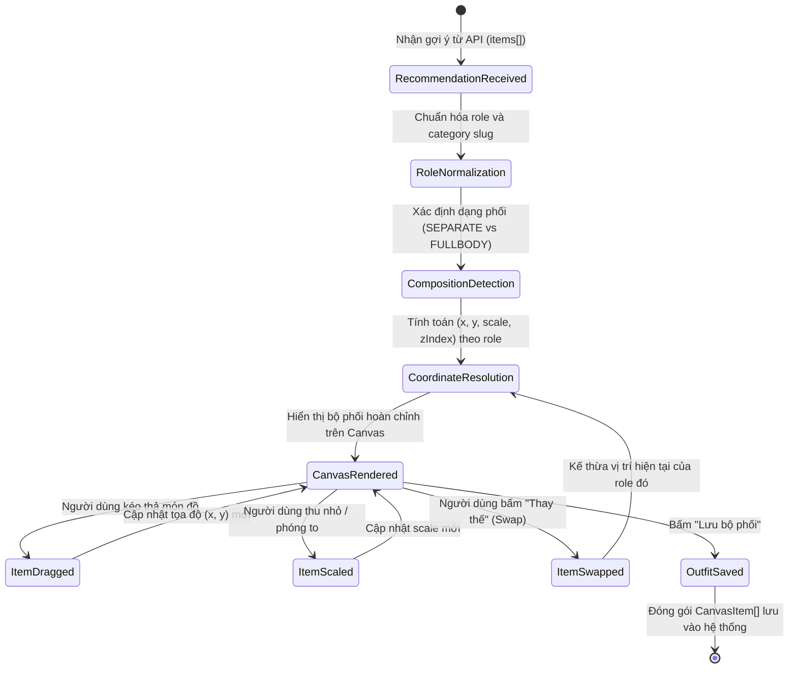

# Data Model: Bố cục Canvas Phối đồ Theo Vai trò Thời trang

**Feature**: `024-ai-stylist-canvas-layout`  
**Date**: 2026-09-26  
**Status**: Completed

---

## 1. Phân loại Vai trò Thời trang (Fashion Roles)

```typescript
/**
 * 8 vai trò thời trang chuẩn trong hệ thống gợi ý phối đồ AI Stylist
 */
export type FashionRole =
  | 'headwear'   // Mũ, nón (đỉnh đầu)
  | 'top'        // Áo (thân trên)
  | 'bottom'     // Quần, chân váy (thân dưới)
  | 'fullbody'   // Đầm liền, jumpsuit (trọn thân trên và dưới)
  | 'outerwear'  // Áo khoác ngoài (mặc layer phủ ngoài)
  | 'footwear'   // Giày dép (chân dưới cùng)
  | 'accessory'  // Phụ kiện: túi xách, kính, trang sức, thắt lưng
  | 'other';     // Mục khác / không xác định
```

---

## 2. Kiểu Cấu trúc Phối đồ (Outfit Composition Type)

```typescript
/**
 * Dạng phối đồ tổng thể quyết định trục giải phẫu chính trên canvas
 */
export type OutfitCompositionType =
  | 'SEPARATE_PIECES' // Dạng rời: top + bottom + footwear (+ outerwear/phụ kiện)
  | 'FULLBODY'        // Dạng liền: fullbody + footwear (+ outerwear/phụ kiện)
  | 'INCOMPLETE';     // Dạng thiếu món (dự phòng, hiển thị an toàn)
```

---

## 3. Cấu hình Tọa độ & Phân tầng Không gian (Canvas Role Layout Node)

```typescript
/**
 * Thông số tọa độ và hiển thị chuẩn của từng vai trò trên khung vẽ
 */
export interface CanvasRoleLayoutNode {
  /** Tọa độ ngang tương đối so với tâm canvas (0, 0) */
  x: number;
  /** Tọa độ dọc tương đối so với tâm canvas (0, 0) */
  y: number;
  /** Tỷ lệ kích thước hiển thị (% so với kích thước gốc) */
  scale: number;
  /** Thứ tự phân tầng hiển thị từ dưới lên trên */
  zIndex: number;
}

/**
 * Bảng cấu hình bố cục không gian theo loại cấu trúc phối
 */
export interface OutfitCanvasLayoutConfig {
  composition: OutfitCompositionType;
  roles: Record<FashionRole, CanvasRoleLayoutNode>;
  /** Tọa độ bổ sung dành cho phụ kiện thứ 2 trở lên */
  secondaryAccessories?: CanvasRoleLayoutNode[];
}
```

---

## 4. Thực thể Món đồ trên Khung vẽ (CanvasItem Specification)

```typescript
import type { BrandItemSnapshot } from '@/features/brands/types';
import type { WardrobeCategory } from '@/features/wardrobe/types';

/**
 * Thực thể biểu diễn một món đồ hoạt động trên bàn phối OutfitCanvasBoard
 */
export interface CanvasItem {
  /** Khóa định danh duy nhất của phần tử trên canvas */
  id: string;
  /** ID trang phục trong tủ đồ hoặc ID món đồ thời trang liên kết */
  clothingItemId?: string;
  /** URL ảnh đã xử lý tách nền */
  imageUrl: string;
  /** Danh mục phân loại của món đồ */
  category?: WardrobeCategory;
  /** Vai trò thời trang chuẩn được gán cho món đồ */
  _role: FashionRole;
  /** Tọa độ X tương đối */
  x: number;
  /** Tọa độ Y tương đối */
  y: number;
  /** Tỷ lệ thu phóng hiện tại */
  scale: number;
  /** Thứ tự phân tầng hiện tại */
  zIndex: number;
  /** Cờ đánh dấu món đồ là vật phẩm ảo/thử nghiệm (Ghost Item) */
  isGhost?: boolean;
  /** Tên thương hiệu đối tác nếu có */
  brandName?: string;
  /** Giá tiền sản phẩm nếu là Brand Item */
  price?: number;
  /** Ngữ cảnh món đồ: 'brand_item' | 'wardrobe_item' */
  itemContext?: string;
  /** ID sản phẩm thương hiệu nếu có */
  brandItemId?: string;
  /** Dữ liệu snapshot chi tiết của Brand Item */
  brandItemSnapshot?: BrandItemSnapshot;
  /** Đánh giá tác động tủ đồ của Ghost Item nếu có */
  wardrobeImpact?: any;
}
```

---

## 5. Quy tắc Bất biến & Ràng buộc Tính toàn vẹn (Invariants & Validation Rules)

1. **Tính Loại Trừ Tuyệt Đối của Đầm Liền (`fullbody`)**:
   - Nếu trong danh sách gợi ý tồn tại món có role là `fullbody`, bất kỳ món nào có role là `top` hoặc `bottom` sẽ bị loại bỏ hoặc vô hiệu hóa hiển thị trên canvas:
     $$\text{hasFullbody} \implies \text{items} \cap \{\text{top}, \text{bottom}\} = \emptyset$$
2. **Tính Duy Nhất của Vai Trò Chính**:
   - Trong trạng thái kết xuất ban đầu, mỗi vai trò chính (`headwear`, `top`, `bottom`, `fullbody`, `outerwear`, `footwear`) chỉ có tối đa 1 phần tử đại diện trên canvas:
     $$\forall r \in \{\text{headwear}, \text{top}, \text{bottom}, \text{fullbody}, \text{outerwear}, \text{footwear}\}, \quad \text{count}(r) \le 1$$
3. **Phân bổ Phụ kiện Không Xâm lấn Trục Trung tâm**:
   - Món `accessory` thứ 1 đặt tại cánh trái ($X \approx -240\text{px}$).
   - Món `accessory` thứ 2 trở lên đặt tại cánh phải ($X \approx +240\text{px}$) với độ lệch chiều cao ($Y$) so le, không xâm phạm vùng an toàn trung tâm $|X| < 120\text{px}$.
4. **Phân tầng Đa lớp cho Áo khoác ngoài (`outerwear`)**:
   - Món `outerwear` luôn có thứ tự $Z$-index cao hơn áo trong (`top`) hoặc đầm (`fullbody`):
     $$\text{zIndex}(\text{outerwear}) > \max(\text{zIndex}(\text{top}), \text{zIndex}(\text{fullbody}))$$
5. **Kế thừa Khi Hoán đổi Món (`Swap`)**:
   - Khi hoán đổi món thay thế cho một vai trò $r$, phần tử mới kế thừa chính xác tọa độ $(X, Y)$, tỷ lệ $\text{scale}$, và thứ tự $\text{zIndex}$ của phần tử cũ đang có trên canvas.

---

## 6. Sơ đồ Chuyển đổi Trạng thái (State Lifecycle Diagram)


