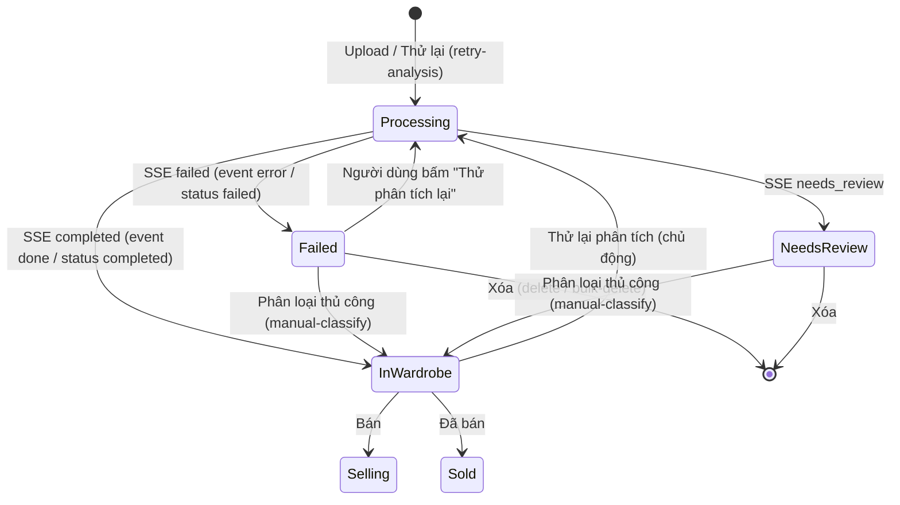

# Data Model: Luồng xử lý khi AI phân tích ảnh lỗi

**Feature**: `025-ai-analysis-failure-handling`
**Date**: 2026-09-28
**Status**: Completed

---

## 1. Trạng thái Trang phục (Wardrobe Item Status)

Giữ nguyên enum hiện có (tương thích backend):

```typescript
export enum WardrobeItemStatus {
  InWardrobe = 0,   // Trong tủ — phân tích thành công, dùng được
  Selling = 1,      // Đang bán
  Sold = 2,         // Đã bán
  Processing = 3,   // Đang chờ AI phân tích
  Failed = 4,       // AI phân tích thất bại
  NeedsReview = 5,  // AI phân tích không chắc chắn, cần người dùng chọn lại danh mục
}
```

---

## 2. Trạng thái Tác vụ Phân tích (Analysis Task Status — nguồn SSE)

```typescript
/**
 * Trạng thái cuối của tác vụ phân tích AI nhận từ SSE.
 * Backend có thể gửi qua event name (`done`/`error`) hoặc field `status`.
 */
export type AnalyzeTaskStatusType = "completed" | "failed" | "needs_review" | string;
```

### 2.1 Mã lỗi Nghiệp vụ (Failure Error Codes)

```typescript
/**
 * Các mã lỗi chuẩn theo docs/Doccument-SSE.md.
 * Backend cũ có thể không gửi errorCode → fallback UNKNOWN.
 */
export type AnalyzeFailureCode =
  | "INVALID_IMAGE_RESOLUTION"  // Ảnh quá mờ/quá nhỏ
  | "UNSUPPORTED_FILE_TYPE"     // Định dạng không hỗ trợ
  | "QUOTA_EXCEEDED"            // Vượt hạn mức phân tích
  | "PROCESSING_TIMEOUT"        // Xử lý quá lâu
  | "UNKNOWN_ERROR";            // Lỗi khác / thiếu mã
```

---

## 3. Trạng thái UI & Hành động Phục hồi (UI Status ↔ Recovery Actions)

| Trạng thái món | Chỉ báo UI danh sách | Chỉ báo UI chi tiết | Hành động phục hồi cho phép |
| :--- | :--- | :--- | :--- |
| `Processing` (3) | Overlay spinner "AI ĐANG XỬ LÝ", ảnh blur | Overlay "AI đang phân tích" | Chờ; click thẻ → refetch (chống spam) |
| `Failed` (4) | Badge "Phân tích thất bại", ảnh gốc rõ | Badge + banner "AI chưa thể nhận diện" | Thử lại / Phân loại thủ công / Xóa |
| `NeedsReview` (5) | Badge "Cần chọn danh mục", ảnh gốc rõ | Banner "Cần chọn lại danh mục" | Phân loại thủ công / Xóa |
| `InWardrobe` (0) | Thẻ bình thường | Thẻ bình thường | — |

> Bất biến: ảnh gốc của món `Failed`/`NeedsReview` luôn hiển thị rõ (không blur như `Processing`) để người dùng ra quyết định (FR-008).

---

## 4. Sơ đồ Chuyển đổi Trạng thái (State Lifecycle Diagram)



**Quy tắc chuyển trạng thái**:

1. `Processing → Failed`: khi SSE `failed`/`error` — optimistic cache cập nhật `status = Failed`, toast lỗi thân thiện, invalidate lists + stats.
2. `Processing → NeedsReview`: khi SSE `needs_review` — cache cập nhật `status = NeedsReview`, toast.info, invalidate.
3. `Failed → Processing`: người dùng bấm "Thử phân tích lại" → mutation `POST /wardrobe-items/:id/retry-analysis`; sau đó theo dõi SSE lại cho task mới.
4. `Failed | NeedsReview → InWardrobe`: phân loại thủ công qua `PUT /wardrobe-items/:id/manual-classify` (form edit hiện có).
5. `Failed | NeedsReview → [*]`: xóa đơn lẻ hoặc hàng loạt.

---

## 5. Bất biến & Ràng buộc Toàn vẹn (Invariants & Validation Rules)

1. **Không món nào kẹt ở `Processing` mãi**: sau khi tải lại trang, trạng thái phải hội tụ về kết quả cuối đúng (SC-004). Nếu SSE bị lỡ (task xong trước khi connect, mất mạng, 504), việc refetch danh sách trên open/reload phải trả về trạng thái cuối.
2. **Mỗi món độc lập trong batch**: một ảnh lỗi không chặn/ghi đè trạng thái các ảnh khác (FR-010). Tóm tắt batch chỉ là thông báo gộp, không thay đổi trạng thái từng món.
3. **Chống trùng lặp thử lại**: khi mutation retry đang chạy (isPending), nút/action phải disabled để không tạo task trùng (FR-005).
4. **Chống toast trùng lặp**: nhiều event `failed` của cùng `taskId` chỉ hiển thị một toast lỗi; các lần sau bỏ qua (dedupe).
5. **Phân biệt `Failed` vs `NeedsReview`**: hai trạng thái hiển thị và hành động khác nhau, không gộp chung thông báo (FR-011).
6. **Không lộ thông tin kỹ thuật**: UI chỉ hiển thị message thân thiện từ `getFailureMessage`; không in raw `errorCode`/stack cho người dùng (FR-002).
7. **Chủ quyền món đồ**: mọi action chỉ tác động lên món thuộc về user đang đăng nhập (kế thừa spec 023 — không thêm scope).

---

## 6. Kiểu Dữ liệu Mở rộng

```typescript
/**
 * Mở rộng payload SSE hiện có: thêm errorCode để ánh xạ message thân thiện.
 */
export interface WardrobeTaskSSEPayload {
  itemId: string;
  status: AnalyzeTaskStatusType;
  total: number;
  index: number;
  data?: WardrobeItemBriefRes | WardrobeItemRes | any;
  error?: string;
  errorCode?: AnalyzeFailureCode;   // [NEW] mã lỗi nghiệp vụ từ backend
  // Fallbacks cho backend cũ
  taskId?: string;
  progress?: number;
  item?: WardrobeItemBriefRes | WardrobeItemRes;
  message?: string;
}
```

```typescript
/**
 * Kết quả tóm tắt một batch phân tích (cho toast gộp).
 */
export interface BatchAnalysisSummary {
  total: number;
  completed: number;
  failed: number;
  needsReview: number;
}
```