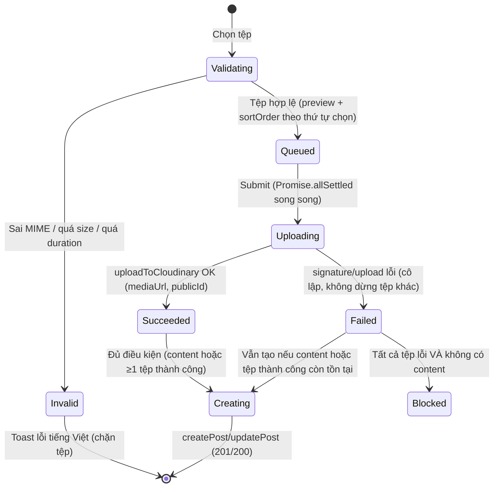
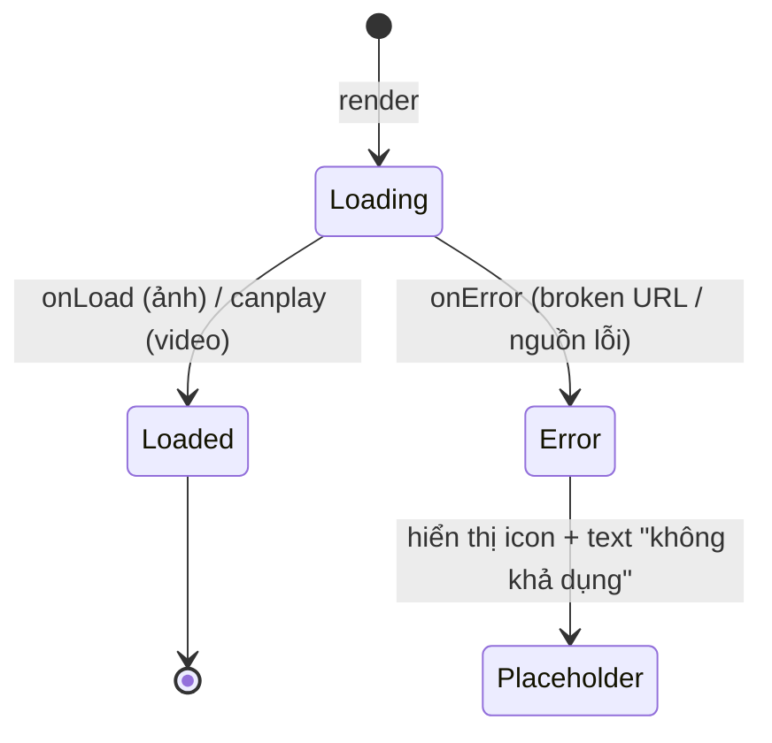

# Data Model: 026 Fix Post Media

**Feature**: `026-fix-post-media`
**Created**: 2026-09-28
**Status**: Ready

Tài liệu này định nghĩa các thực thể liên quan đến bài đăng `media`, quy tắc hiển thị `media[]`, bảng validation client-side, và trạng thái lỗi/fallback. Tham chiếu contract: `specs/022-community-social/contracts/frontend-integration.md` (§3.2, §3.3, §3.12).

---

## 1. Core Data Entities

### 1.1 Post Media (`PostMediaRes` / `PostMediaReq`)
Tệp ảnh hoặc video đính kèm bài đăng `media`.

```typescript
export interface PostMediaRes {
  id: string;
  mediaType: 'image' | 'video';
  mediaUrl: string;
  publicId?: string;
  sortOrder: number;
}

export interface PostMediaReq {
  mediaType: 'image' | 'video';
  mediaUrl: string;
  publicId?: string;
  sortOrder: number;
}
```

- `mediaType`: bắt buộc, chữ thường, chỉ `'image' | 'video'`.
- `sortOrder`: thứ tự hiển thị trong bài (tăng dần); tệp đầu tiên (nhỏ nhất) là ảnh chính.

### 1.2 Post Entity (phần liên quan media) — `PostRes`
```typescript
export interface PostRes {
  postType: 'outfit' | 'media';
  media?: PostMediaRes[]; // omitempty: VẮNG key (không phải null) khi bài không có tệp; tối đa 10
  outfit?: OutfitBriefRes | null; // chỉ khi postType = 'outfit'
  content: string;
  title?: string | null;
  // ... (các trường còn lại giữ nguyên từ contract 022)
}
```

### 1.3 Post Detail View Model
Dữ liệu phục vụ component `PostMediaGallery`:

```typescript
export interface MediaGalleryItem {
  mediaType: 'image' | 'video';
  mediaUrl: string;
  sortOrder: number;
}
```

- Được dẫn xuất từ `post.media` sắp xếp theo `sortOrder` tăng dần.
- Không tạo entity riêng — chỉ là view-model của `PostMediaRes[]`.

---

## 2. Quy tắc hiển thị `media[]` (Render Rules)

| Tình huống | Hành vi render |
|---|---|
| `postType === 'media'` và `media.length === 0` | Không render vùng media; chỉ hiển thị nội dung chữ + title |
| `postType === 'media'` và `media.length === 1` | Render tệp duy nhất (ảnh full hoặc `VideoPlayer`) |
| `postType === 'media'` và `media.length > 1` | Render `PostMediaGallery`: tệp đầu làm ảnh chính lớn, các tệp còn lại làm lưới ô nhỏ; lightbox khi bấm mở |
| `postType === 'outfit'` | Render `post.outfit.coverImageUrl` + thẻ thông tin trang phục (giữ nguyên hành vi 022) |
| URL tệp lỗi (ảnh `onError` / video `onError`) | Render placeholder (icon + text), không vỡ layout, giữ nguyên `aspect-[4/5]` |
| `user = null` (backend không lấy được hồ sơ) | Hiển thị "Người dùng ẩn danh" phòng thủ, không crash |

### 2.1 Thứ tự sắp xếp
- Gallery sắp xếp theo `sortOrder` tăng dần.
- Nếu `sortOrder` trùng lặp → giữ thứ tự xuất hiện trong mảng `media` (stable sort).

### 2.2 Feed card — dấu hiệu số lượng tệp
- `postType === 'media'` và `media.length > 1` → badge góc trên: `+{N-1}` (hoặc icon ảnh kèm tổng số).
- Không thay đổi `aspect-[4/5]` và luồng điều hướng sang `/posts/{publicId}`.

---

## 3. Validation Rules (Client-side)

| Trường / hành động | Giới hạn (contract §3.12) | Thông báo tiếng Việt |
|---|---|---|
| `title` | ≤ 150 ký tự | "Tiêu đề không được vượt quá 150 ký tự." |
| `content` (bài) | ≤ 5000 ký tự | "Nội dung bài viết không được vượt quá 5000 ký tự." |
| `media` | ≤ 10 tệp/bài | "Mỗi bài viết chỉ được đính kèm tối đa 10 tệp." |
| Ảnh — định dạng | `image/jpeg`, `image/png`, `image/webp` | "Ảnh chỉ hỗ trợ định dạng jpg, png, webp." |
| Ảnh — dung lượng | ≤ 10 MB | "Ảnh vượt quá dung lượng tối đa 10MB." |
| Video — định dạng | `video/mp4`, `video/webm` | "Video chỉ hỗ trợ định dạng mp4, webm." |
| Video — dung lượng | ≤ 100 MB | "Video vượt quá dung lượng tối đa 100MB." |
| Video — thời lượng | ≤ 60 giây | "Video vượt quá thời lượng tối đa 60 giây." |
| Bài `media` — nội dung | Cần `content ≠ ""` HOẶC `media.length ≥ 1` | "Bài viết phải có ít nhất nội dung chia sẻ hoặc 1 hình ảnh/video." |
| `postType` khi chỉnh sửa | Không đổi loại bài | (UI khóa tab chọn loại) |

---

## 4. State Transitions & Lifecycle

### 4.1 Luồng tải tệp trong PostComposerModal


### 4.2 Trạng thái hiển thị tệp


---

## 5. Error Handling

| Lỗi | Hành vi |
|---|---|
| Tệp không hợp lệ (MIME/size/duration) | Chặn ngay khi chọn, toast tiếng Việt, không gọi API |
| Signature upload lỗi | Cô lập tệp, toast liệt kê tệp lỗi, các tệp khác tiếp tục |
| Tất cả tệp lỗi + không có content | Chặn submit, toast lỗi |
| 400 (validate backend) | Hiển thị `message`/`errors[]` từ backend |
| 401 (chưa đăng nhập) | Chuyển hướng đăng nhập / thông báo |
| 429 (rate limit) | Thông báo "thao tác quá nhanh, thử lại sau", không retry dồn dập |
| Media URL lỗi | Placeholder tại ô đó, không ảnh hưởng các ô khác |