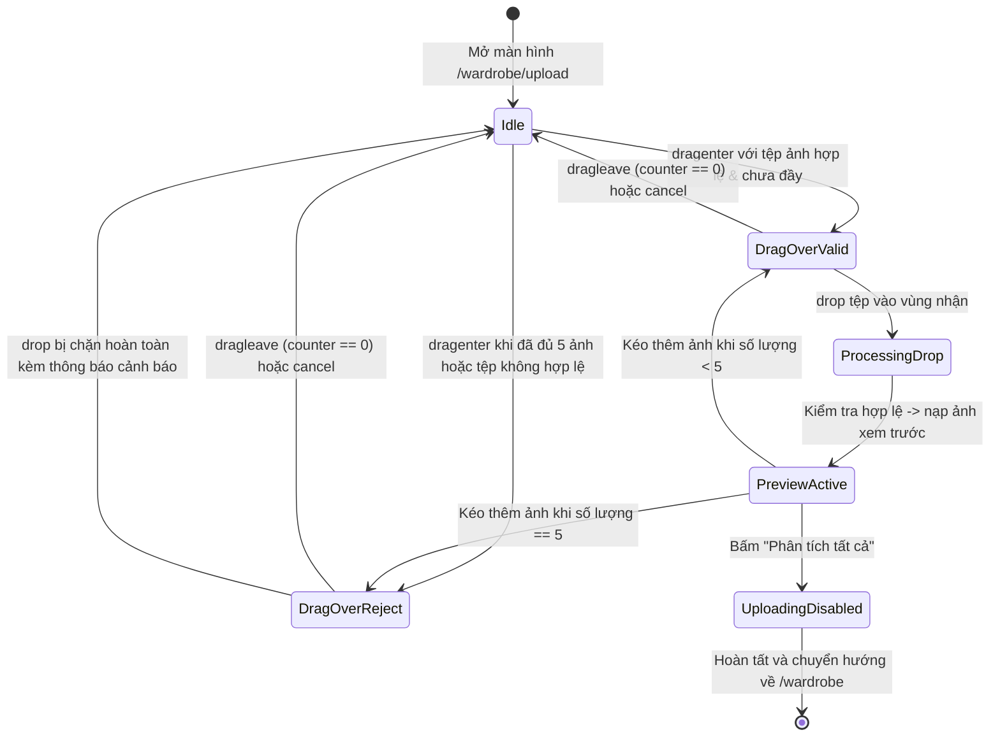

# Data Model & State Machine: Kéo thả tệp hình ảnh vào tủ đồ

**Feature**: `028-wardrobe-drag-drop-upload`  
**Date**: 2026-10-04  
**Status**: Completed  

---

## 1. Entities & Types

### 1.1 `SelectedFile` (Thực thể tệp ảnh đã chọn)
Biểu diễn một ảnh đã qua kiểm tra hợp lệ và được đưa vào hàng đợi chuẩn bị phân tích:

```typescript
export interface SelectedFile {
  /** Định danh duy nhất của tệp trong phiên (dùng làm key React và xóa phần tử) */
  id: string;

  /** Đối tượng tệp tin thô chuẩn DOM File API */
  file: File;

  /** Đường dẫn URL tạm thời tạo bởi URL.createObjectURL để hiển thị xem trước */
  preview: string;

  /** Mã danh mục trang phục mặc định (mặc định trỏ về "Khác" hoặc danh mục đầu tiên) */
  categoryId: string;
}
```

---

### 1.2 `DropzoneState` (Trạng thái tương tác kéo thả)
Quản lý trạng thái trực quan và hành vi của khu vực tiếp nhận kéo thả:

```typescript
export interface DropzoneState {
  /** Có tệp đang được rê vào vùng dropzone hay không */
  isDragActive: boolean;

  /** Tệp đang rê vào có bị từ chối hay không (ví dụ: đã đầy 5 ảnh hoặc toàn bộ tệp sai định dạng) */
  isDragReject: boolean;

  /** Vùng kéo thả có đang bị khóa hay không (khi uploadState.status !== 'idle') */
  isDisabled: boolean;
}
```

---

### 1.3 `FileValidationOptions` & `FileValidationResult`
Quy tắc kiểm duyệt tệp và kết quả sau khi xử lý sự kiện thả:

```typescript
export interface FileValidationOptions {
  /** Số lượng tệp tối đa cho phép trong phiên (mặc định: 5) */
  maxFiles: number;

  /** Dung lượng tối đa của một tệp tính theo bytes (mặc định: 5 * 1024 * 1024 = 5MB) */
  maxSizeBytes: number;

  /** Các đuôi mở rộng hợp lệ */
  acceptedExtensions: string[];

  /** Số lượng tệp hiện đã có trong danh sách */
  currentCount: number;
}

export type FileRejectionReason = 
  | 'INVALID_TYPE'     // Tệp không phải hình ảnh
  | 'EXCEEDS_SIZE'     // Dung lượng vượt quá 5MB
  | 'EXCEEDS_COUNT'    // Vượt quá số lượng cho phép trong mẻ (tối đa 5)
  | 'IS_DIRECTORY'     // Thư mục không thể nạp trực tiếp
  | 'DUPLICATE_FILE';  // Tệp bị trùng lặp với ảnh đã chọn trước đó

export interface RejectedFileItem {
  file: File;
  reason: FileRejectionReason;
  message: string;
}

export interface FileValidationResult {
  /** Danh sách các File hợp lệ sẵn sàng đưa vào SelectedFile */
  acceptedFiles: File[];

  /** Danh sách các File bị từ chối kèm lý do cụ thể */
  rejectedFiles: RejectedFileItem[];
}
```

---

## 2. Dropzone State Machine (Máy trạng thái kéo thả)



---

## 3. Quy tắc chuyển trạng thái & Xử lý sự kiện

| Trạng thái hiện tại | Sự kiện kích hoạt | Điều kiện kiểm tra | Trạng thái tiếp theo | Hành vi tương ứng |
| :--- | :--- | :--- | :--- | :--- |
| **Idle** (0 ảnh) | `dragenter` | `!isDisabled` && `hasFiles` | **DragOverValid** | Tăng `dragCounter`, hiển thị viền nổi bật `border-primary`, nền nhấn, nhãn "Thả file vào đây" |
| **DragOverValid** | `dragleave` | `dragCounter == 0` | **Idle** | Trở về viền mờ `border-border`, nền gốc |
| **DragOverValid** | `drop` | Các tệp được nhả ra | **ProcessingDrop** | Reset `dragCounter = 0`, lọc tệp theo `validateFiles()`, tạo preview URL |
| **ProcessingDrop** | Kiểm tra xong | Có ít nhất 1 tệp hợp lệ | **PreviewActive** | Cập nhật `files` state, chuyển sang giao diện Step 2 |
| **PreviewActive** (< 5 ảnh) | `dragenter` (trên Card thêm ảnh hoặc container) | `files.length < 5` | **DragOverValid** | Làm nổi bật card thêm ảnh hoặc viền danh sách |
| **PreviewActive** (== 5 ảnh) | `dragenter` | `files.length >= 5` | **DragOverReject** | Hiển thị viền cảnh báo hoặc con trỏ `not-allowed` |
| **PreviewActive** | Bấm phân tích | `files.length > 0` | **UploadingDisabled** | Khóa toàn bộ tương tác kéo thả và input tệp |
