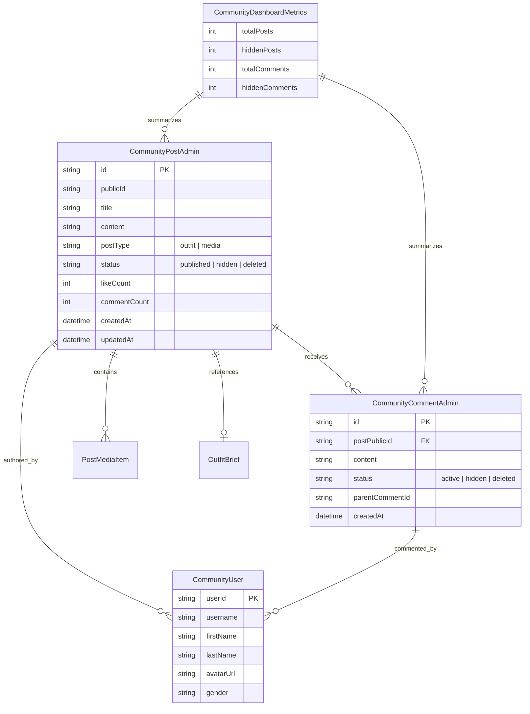
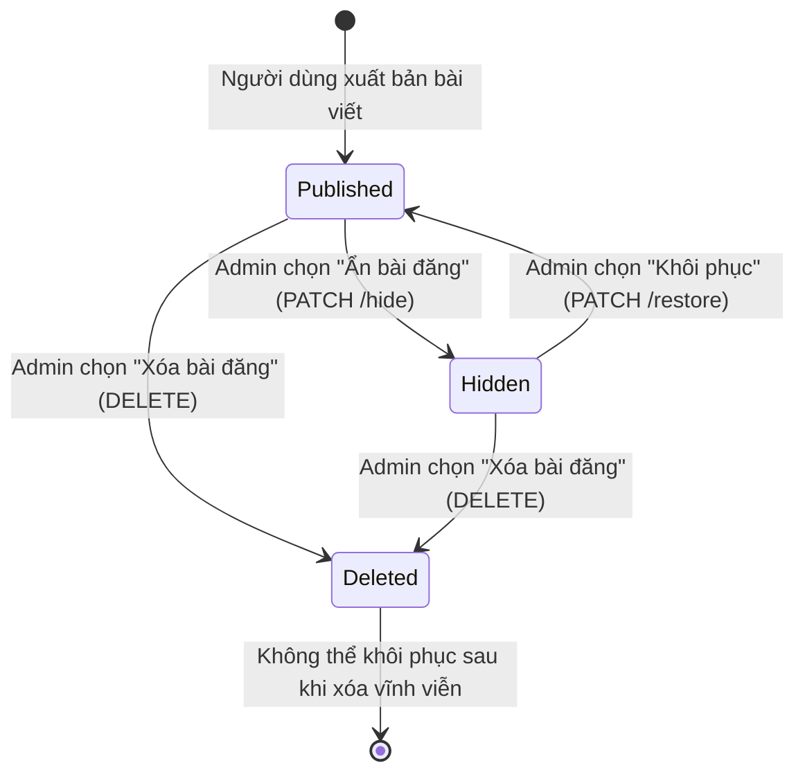
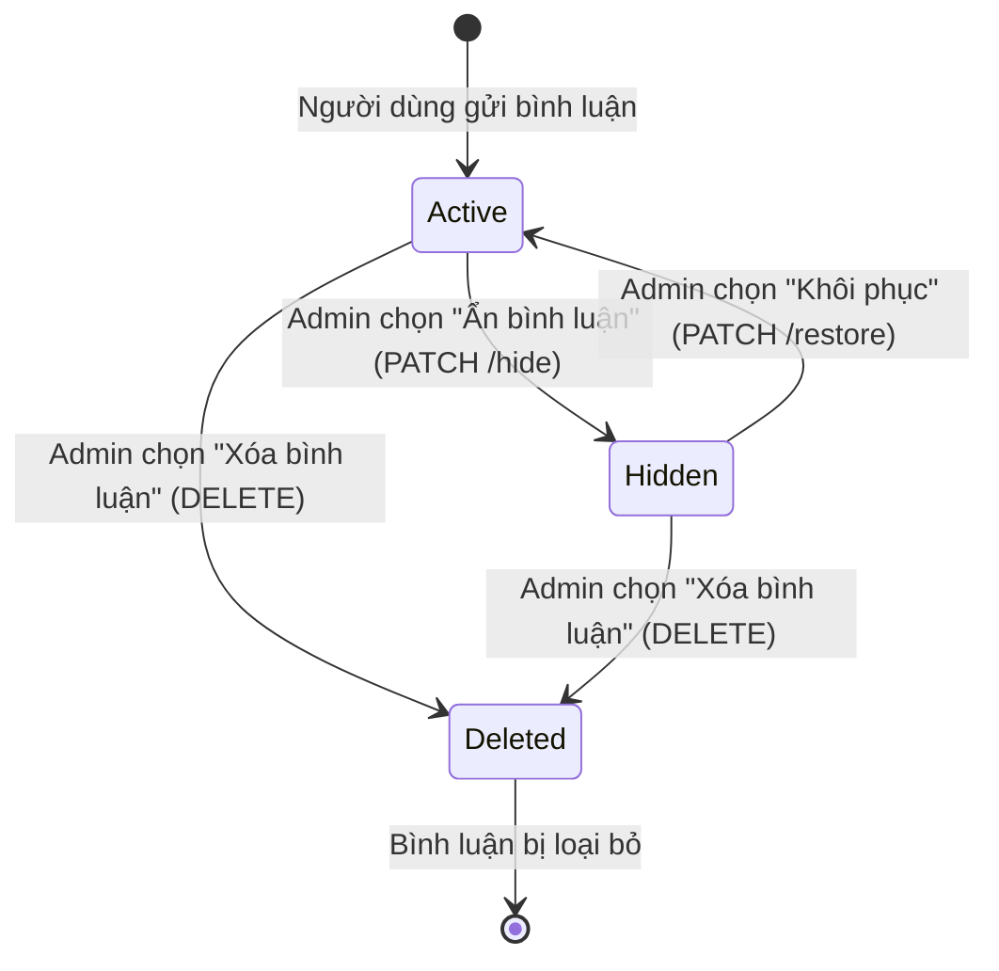

# Data Model: Community Admin Dashboard

**Feature**: [spec.md](./spec.md) | **Branch**: `029-community-admin-dashboard` | **Date**: 2026-10-04

---

## 1. Sơ đồ Thực thể (Entity Relationship)



---

## 2. Chi tiết Kiểu dữ liệu & Giao diện (TypeScript Models)

### 2.1. Quản trị Bài đăng (`CommunityPostAdmin`)

```typescript
export type PostModerationStatus = 'published' | 'hidden' | 'deleted';
export type PostType = 'outfit' | 'media';

export interface CommunityPostAdmin {
  id: string;
  publicId: string;
  title: string;
  content: string;
  postType: PostType;
  status: PostModerationStatus;
  user: {
    userId: string;
    username: string;
    firstName: string;
    lastName: string;
    avatarUrl?: string;
    gender?: string;
  };
  media?: Array<{
    id: string;
    url: string;
    mediaType: 'image' | 'video';
    orderIndex?: number;
  }>;
  outfit?: {
    outfitId: string;
    name: string;
    coverUrl?: string;
    season?: string;
    style?: string;
  };
  likeCount: number;
  commentCount: number;
  isLiked?: boolean;
  createdAt: string;
  updatedAt?: string;
}
```

### 2.2. Quản trị Bình luận (`CommunityCommentAdmin`)

```typescript
export type CommentModerationStatus = 'active' | 'hidden' | 'deleted';

export interface CommunityCommentAdmin {
  id: string;
  postId?: string;
  postPublicId?: string;
  postTitle?: string;
  content: string;
  status: CommentModerationStatus;
  parentCommentId?: string | null;
  replyCount?: number;
  user: {
    userId: string;
    username: string;
    firstName: string;
    lastName: string;
    avatarUrl?: string;
    gender?: string;
  };
  createdAt: string;
  updatedAt?: string;
}
```

### 2.3. Chỉ số Tổng quan Dashboard (`CommunityDashboardMetrics`)

```typescript
export interface CommunityDashboardMetrics {
  totalPosts: number;
  publishedPosts: number;
  hiddenPosts: number;
  deletedPosts: number;
  totalComments: number;
  activeComments: number;
  hiddenComments: number;
  deletedComments: number;
}
```

### 2.4. Trạng thái Bộ lọc & Phân trang (Filter & Pagination States)

```typescript
export interface PostFilterState {
  searchQuery: string;
  status: 'all' | PostModerationStatus;
  page: number;
  limit: number;
}

export interface CommentFilterState {
  searchQuery: string;
  status: 'all' | 'active' | 'deleted' | 'hidden';
  page: number;
  limit: number;
}
```

---

## 3. Máy Trạng thái Nội dung (Content State Transitions)

### 3.1. Vòng đời Trạng thái Bài viết (Post Lifecycle)



### 3.2. Vòng đời Trạng thái Bình luận (Comment Lifecycle)



---

## 4. Quy tắc Kiểm định & Ràng buộc Dữ liệu (Validation & Business Rules)

1. **Hiển thị nhãn trạng thái**:
   - `published` / `active`: Huy hiệu xanh lá (Green Badge - "Công khai" / "Hoạt động").
   - `hidden`: Huy hiệu vàng cam (Amber/Warning Badge - "Đang ẩn").
   - `deleted`: Huy hiệu xám hoặc đỏ nhạt (Destructive/Muted Badge - "Đã xóa").
2. **Khóa hành động khi đang xử lý (Pending State)**:
   - Trong quá trình gọi mutation (ẩn, khôi phục, xóa), nút bấm tương ứng phải hiển thị spinner `Loader2` và vô hiệu hóa (`disabled`) để tránh double-submit.
3. **Bắt buộc xác nhận trước khi xóa (Safety Guard)**:
   - Thao tác xóa `DELETE` luôn yêu cầu xác nhận qua `AlertDialog` để tránh việc vô tình click nhầm làm mất dữ liệu.
