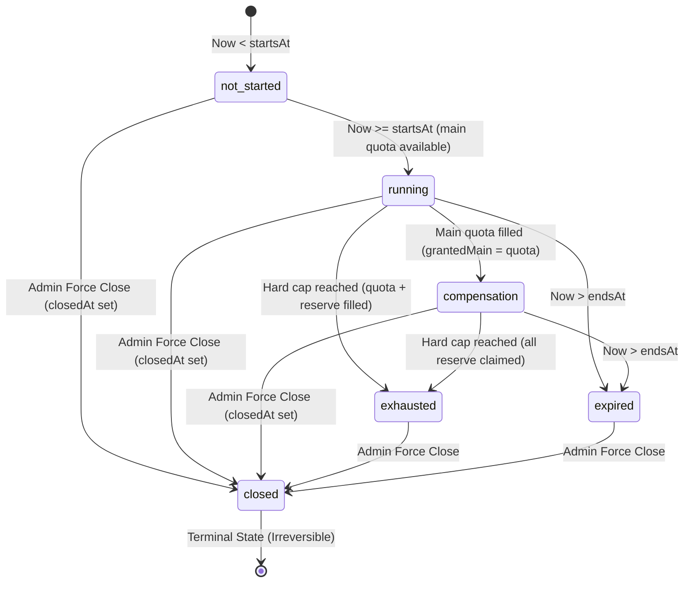
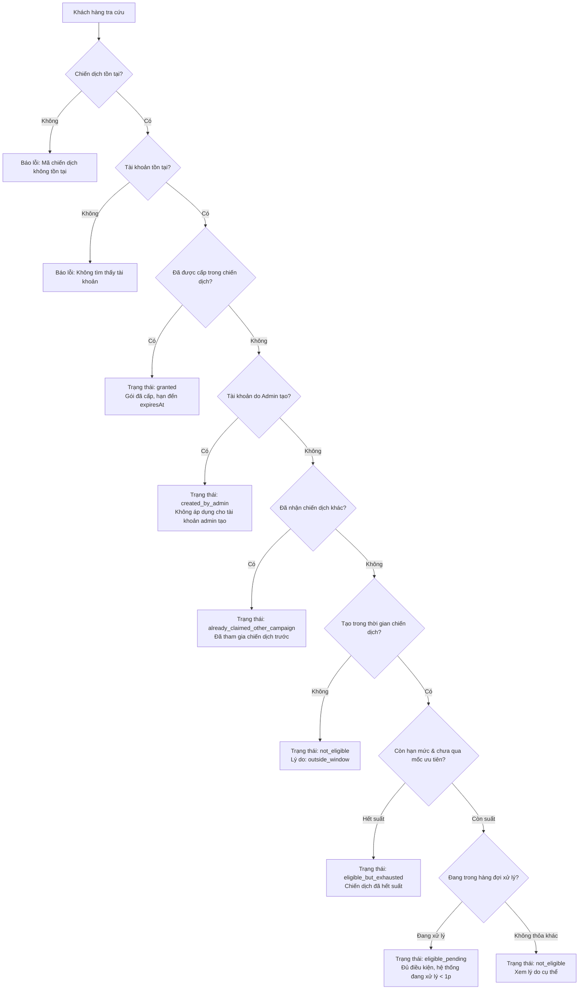
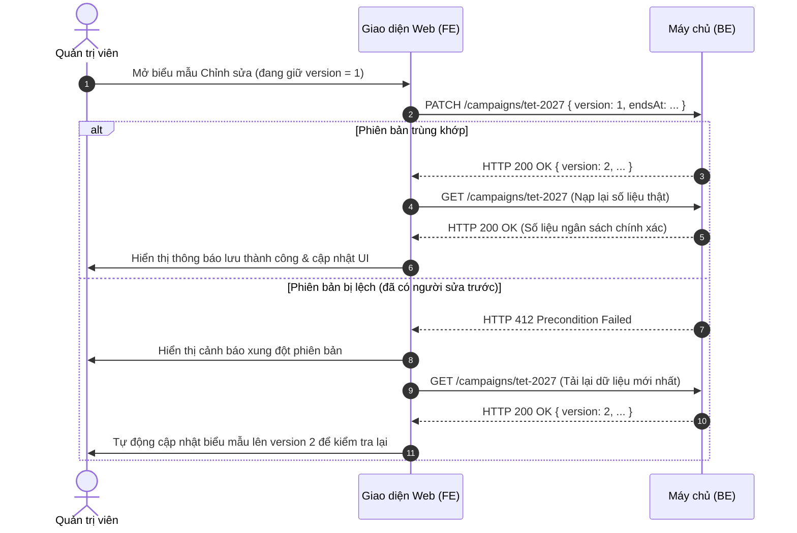

# Phase 1: Data Model & State Transitions - Admin Campaign Management & Eligibility Lookup

**Feature**: `031-admin-campaign-management`  
**Date**: 2026-10-05  
**Spec Reference**: [spec.md](./spec.md)

---

## 1. Domain Entities & TypeScript Models

### 1.1 Campaign Summary (`CampaignSummaryRes`)

The 21 fields contract returned by `GET /api/v1/admin/campaigns` and `GET /api/v1/admin/campaigns/{code}`:

```typescript
export type CampaignStatus = 
  | 'not_started'    // Chưa tới startsAt
  | 'running'        // Đang mở, còn suất chính
  | 'compensation'   // Hết suất chính, đã chốt watermark, còn suất dự phòng
  | 'exhausted'      // Đã chạm trần cứng quota + reserve
  | 'expired'        // Đã qua endsAt
  | 'closed';        // Quản trị viên đóng cưỡng bức (ưu tiên cao nhất)

export interface CampaignSummaryRes {
  code: string;                     // Mã định danh chiến dịch (bất biến sau khi tạo)
  planSlug: string;                 // Mã gói cước (ví dụ: premium-monthly)
  planName: string;                 // Tên hiển thị của gói (ví dụ: Premium Tháng)
  quota: number;                    // Hạn mức chính (>= 1)
  reserve: number;                  // Suất dự phòng (>= 0)
  grantedMainCount: number;         // Số suất chính đã cấp thực tế
  grantedCompensationCount: number; // Số suất dự phòng đã cấp thực tế
  grantedTotalCount: number;        // Tổng số đã cấp (main + compensation)
  remainingMain: number;            // Suất chính còn lại (max(0, quota - grantedMainCount))
  remainingCompensation: number;    // Suất dự phòng còn lại
  hardCap: number;                  // Trần cứng tối đa (quota + reserve)
  startsAt: string;                 // Thời điểm bắt đầu (RFC3339 có múi giờ)
  endsAt: string | null;            // Thời điểm kết thúc (RFC3339 có múi giờ hoặc null = vô thời hạn)
  watermarkAt: string | null;       // Thời điểm đăng ký của lượt cấp thứ quota (chốt mốc ưu tiên)
  status: CampaignStatus;           // Trạng thái vòng đời chiến dịch
  degraded: boolean;                // Cờ cảnh báo lỗi worker cấp gói nền
  degradedReason?: string;          // Lý do kỹ thuật khi worker bị suy giảm/lỗi
  lastSweepAt: string | null;       // Lần quét bù thành công gần nhất
  closedAt: string | null;          // Thời điểm quản trị viên đóng cưỡng bức
  budgetLocked: boolean;            // true khi đã cấp ít nhất 1 suất (grantedTotalCount > 0)
  version: number;                  // Số phiên bản phục vụ kiểm soát đồng thời (bắt đầu từ 1)
}
```

---

### 1.2 Campaign Claim (`CampaignClaimItem`)

The individual claim record returned by `GET /api/v1/admin/campaigns/{code}/claims`:

```typescript
export type ClaimSource = 'main' | 'reserve';

export interface CampaignClaimItem {
  userId: string;                   // UUID của tài khoản người dùng
  username: string;                 // Tên đăng nhập của người dùng
  planSlug: string;                 // Mã gói cước được cấp
  expiresAt: string;                // Thời điểm gói cước hết hạn (RFC3339)
  grantedAt: string;                // Thời điểm thực tế hệ thống cấp gói (RFC3339)
  registeredAt: string;             // Thời điểm người dùng đăng ký tài khoản (RFC3339)
  source: ClaimSource;              // Nguồn ngân sách: "main" (chính) hoặc "reserve" (dự phòng)
}

export interface CampaignClaimsPaginationRes {
  items: CampaignClaimItem[];
  metadata: {
    page: number;
    limit: number;
    totalItems: number;
    totalPages: number;
  };
}
```

---

### 1.3 Customer Eligibility (`EligibilityRes`)

Result of `GET /api/v1/admin/campaigns/{code}/eligibility/{userId}`:

```typescript
export type EligibilityStatus = 
  | 'granted'                         // Đã được cấp trong chiến dịch này
  | 'eligible_pending'                // Đủ điều kiện, đang chờ xử lý (< 1 phút)
  | 'eligible_but_exhausted'          // Đủ điều kiện nhưng hết suất / sau watermark
  | 'not_eligible'                    // Không thỏa mãn điều kiện
  | 'already_claimed_other_campaign'  // Đã nhận gói ở chiến dịch trước
  | 'created_by_admin';               // Do quản trị viên tạo

export type EligibilityReasonCode =
  | ''                                // Rỗng (hợp lệ ở granted và eligible_pending)
  | 'campaign_not_configured'
  | 'campaign_not_started'
  | 'campaign_sleeping'
  | 'created_by_admin'
  | 'already_claimed'
  | 'already_on_plan'
  | 'plan_not_settled'
  | 'outside_window'
  | 'quota_main'
  | 'quota_compensation'
  | 'quota_anomaly'
  | 'plan_unavailable';

export interface EligibilityRes {
  campaignCode: string;               // Mã chiến dịch được tra cứu
  userId: string;                     // Mã người dùng được tra cứu
  eligibility: EligibilityStatus;     // 1 trong 6 trạng thái điều kiện
  granted: boolean;                   // true nếu đã được cấp thành công
  watermarkAt: string | null;         // Mốc ưu tiên của chiến dịch tại thời điểm tra cứu
  userRegisteredAt: string;           // Thời điểm người dùng tạo tài khoản
  reason?: EligibilityReasonCode;     // Mã lý do giải thích (12 mã hoặc rỗng)
}
```

---

### 1.4 Campaign Audit Log (`CampaignAuditItem`)

Audit record returned by `GET /api/v1/admin/campaigns/{code}/audit`:

```typescript
export type CampaignAuditAction = 
  | 'campaign.create' 
  | 'campaign.update' 
  | 'campaign.close';

export interface CampaignAuditCreatePayload {
  campaignCode: string;
  planSlug: string;
  quota: number;
  reserve: number;
  startsAt: string;
  endsAt: string | null;
}

export interface CampaignAuditUpdatePayload {
  campaignCode: string;
  before: {
    version: number;
    quota?: number;
    reserve?: number;
    planSlug?: string;
    startsAt?: string;
    endsAt?: string;
  };
  after: {
    version: number;
    quota?: number;
    reserve?: number;
    planSlug?: string;
    startsAt?: string;
    endsAt?: string;
  };
}

export interface CampaignAuditClosePayload {
  campaignCode: string;
  reason: string;
  before: {
    closedAt: string;
    version: number;
  };
  after: {
    closedAt: string;
    version: number;
  };
}

export type CampaignAuditPayload = 
  | CampaignAuditCreatePayload 
  | CampaignAuditUpdatePayload 
  | CampaignAuditClosePayload;

export interface CampaignAuditItem {
  id: string;                         // UUID của bản ghi nhật ký
  actorUserId: string;               // UUID của quản trị viên thực hiện thao tác
  action: CampaignAuditAction;       // 1 trong 3 hành động
  targetType: 'campaign';             // Luôn là "campaign"
  targetId: null;                    // ⚠️ LUÔN LÀ NULL trong JSON
  payload: CampaignAuditPayload;     // Chi tiết thay đổi tương ứng từng hành động
  requestIp?: string;                 // Địa chỉ IP gửi yêu cầu
  createdAt: string;                 // Thời điểm ghi nhận nhật ký (RFC3339)
}

export interface CampaignAuditPaginationRes {
  items: CampaignAuditItem[];
  metadata: {
    page: number;
    limit: number;
    totalItems: number;
    totalPages: number;
  };
}
```

---

### 1.5 Request Payloads & Validation Schemas

```typescript
// 1. Create Campaign
export interface CreateCampaignReq {
  code: string;
  planSlug: string;
  quota: number;
  reserve?: number;
  startsAt: string;
  endsAt?: string | null;
}

// 2. Update Campaign
export interface UpdateCampaignReq {
  version: number;
  planSlug?: string;
  quota?: number;
  reserve?: number;
  startsAt?: string;
  endsAt?: string | null;
}

// 3. Close Campaign
export interface CloseCampaignReq {
  version: number;
  reason: string;
}
```

---

## 2. State Machines & Business Transitions

### 2.1 Campaign Lifecycle State Machine



**Precedence Rule**:
`closed` takes highest precedence over all other statuses, regardless of current time or budget counts.

---

### 2.2 Customer Eligibility Evaluation Decision Tree



---

### 2.3 Optimistic Concurrency & Version Control Flow


